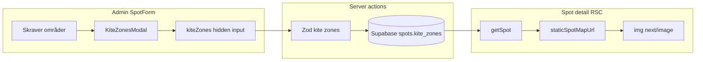

# Spot kite zones (admin editor + public static map)

## Data model

- Add nullable `**kite_zones**` column on `[public.spots](supabase/migrations/0001_initial_schema.sql)`: `jsonb` (stores a versioned GeoJSON document).
- **On-disk shape** (v1): a small wrapper or pure `FeatureCollection` with `schemaVersion: 1` and `features[]` where each feature has:
  - `id` (string UUID, client-generated),
  - `properties`: `{ color: "red" | "yellow" | "green", tag: string, zIndex?: number }` (stack order = array index or explicit `zIndex`),
  - `geometry`: `Polygon` with one ring, **closed** (first point equals last), **minimum 4 positions** (3 unique vertices + closure), WGS84.
- New migration file after `[0008_fix_course_participants_rls_recursion.sql](supabase/migrations/0008_fix_course_participants_rls_recursion.sql)`, e.g. `0009_spot_kite_zones.sql`.
- Regenerate or manually extend `[src/types/database.ts](src/types/database.ts)` so `spots.Row` includes `kite_zones: Json | null` (match your usual workflow).

## Server validation and persistence

- Extend `[src/lib/validations/spots.ts](src/lib/validations/spots.ts)` with a `**kiteZones`** field: optional string (JSON) from FormData, parsed with `zod`, enforcing schema version, feature count limits (reasonable cap), **each polygon ≥ 3 vertices** (validate the ring before/after normalization), **non-empty `tag`**, and allowed colors only.
- `[src/lib/actions/spots.ts](src/lib/actions/spots.ts)`: read `kiteZones` (or `kiteZonesJson`) from `FormData` in `**createSpot**` and `**updateSpot**`; on validation failure return a **clear Norwegian** error (e.g. list which polygon/tag is incomplete). Persist as JSON to `kite_zones` on insert/update (same pattern as other scalar fields). `revalidatePath` should include `**/spots/[id]`** when a spot is saved so the static map updates.

## Shared helpers (types + static URL)

- Add a small module (e.g. `[src/lib/kite-zones/schema.ts](src/lib/kite-zones/schema.ts)`) exporting TypeScript types + **normalize** (ensure closed ring, strip duplicate closure on edit boundary if needed).
- Add `[src/lib/maps/staticSpotMapUrl.ts](src/lib/maps/staticSpotMapUrl.ts)` (server-only usage): build a **[Maps Static API](https://developers.google.com/maps/documentation/maps-static/overview)** URL:
  - **API key**: reuse `NEXT_PUBLIC_GOOGLE_MAPS_API_KEY` (document enabling **Maps Static API** in GCP; same referrer restrictions as JS).
  - **Marker** at spot lat/lng when present.
  - `**path=`** per polygon: `fillcolor` / `color` with alpha hex, `weight`, lat-lng pairs (20–30 total points is safe; no simplification required for v1).
  - **Framing**: if any polygon exists, append repeated `**visible=`** for all polygon vertices plus the spot coordinate so Google fits the view; **else** if only spot coords, use `**zoom=11`** and `center=lat,lng`. If neither coords nor polygons, skip the map block (per spec).
  - Map type: `**maptype=satellite`** to align with `[useMapInstance.ts](src/components/admin/MapCoordinatesPicker/hooks/useMapInstance.ts)`.

## Admin UI — placement and form wiring

- In `[src/components/admin/tabs/spots-tab.tsx](src/components/admin/tabs/spots-tab.tsx)` `**SpotForm`**:
  - Insert the new block **after Vanntype, before Bilde** (matches your decision).
  - Add `**Skraver områder`** button opening a modal; a **hidden input** `name="kiteZones"` (or agreed name) holds the JSON string.
  - Initialize from `spot?.kite_zones` when editing; default `null`/empty when creating.

## Admin UI — `KiteZonesModal` (new)

- New client component folder under e.g. `[src/components/admin/KiteZonesEditor/](src/components/admin/KiteZonesEditor/)`: modal using existing `[Dialog](src/components/ui/dialog.tsx)` patterns from `[MapCoordinatesModal.tsx](src/components/admin/MapCoordinatesPicker/MapCoordinatesModal.tsx)`.
- **Map**: Reuse the loader approach from `[useMapInstance.ts](src/components/admin/MapCoordinatesPicker/hooks/useMapInstance.ts)` (consider extracting shared `initMap` or a thin `useKiteZonesMap` that sets `disableDefaultUI: false` or minimal controls so mobile users can zoom—**gestureHandling: greedy** already matches).
- **Top row**: color **select** (`red` / `yellow` / `green`), **tag** text input, **Opprett** — creates a new polygon entry in state (empty path), **auto-selects** it, appends to list.
- **Collapsible panel above the map** (no existing Radix Collapsible in repo): use **native `
` / `
`** styled to match, **default open** on first open; list rows show tag + color, **Velg** (select), **X** (delete whole polygon).
- **Editing**:
  - Only the **selected** polygon receives **map clicks** that **append** a vertex.
  - **Draggable `Marker`s** per vertex: **drag = move vertex**; **tap/click marker = remove** (with confirm only if you want—spec said remove on click).
  - **Map pan**: when gesture does not start on a vertex marker, default map pan/zoom applies (“duh” behavior)—implemented by **not** capturing drags on the map surface except click for add-point.
  - `**google.maps.Polygon`** per feature: update `paths` when vertices change; **selected** polygon: **higher `fillOpacity` + slightly thicker stroke**; unselected: lower opacity (values ~0.45 vs ~0.22 as discussed).
  - **Z-order**: render order follows creation/stack order (later on top).
- **Footer**: **Avbryt** (discard modal changes vs snapshot on open—recommend **revert to snapshot** on cancel), **Lagre** commits current state to hidden input + closes.
- **Mobile-first**: large touch targets on list rows and markers; modal **max height** and map **min-height** similar to existing map modal.

## Public spot page

- `[src/app/spots/[id]/page.tsx](src/app/spots/[id]/page.tsx)`: when `**hasCoords`** (or when zones exist and you still want a bounds-only map—your spec centers on lat/lng fallback zoom 11), render a new **Section** (e.g. **Kart** / **Områder**) **above or beside existing content** as you prefer visually:
  - Server-compute `staticSpotMapUrl(spot)`; render with `**` or `next/image`** (`unoptimized` if needed for external Google domain—configure `[next.config](next.config.ts)` `images.remotePatterns` for `maps.googleapis.com` if using `Image`).
  - **No link / no click action** on the image (display-only).
  - **Legend** below: list each polygon’s **tag** with a color swatch (semantic color only for legend; meaning is tag text).
- If `**kite_zones` is null/empty** but coords exist: still show **static map** at **zoom 11** with marker only.

## Ops / env

- Document in README or `.env.example`: enable **Maps Static API** alongside existing JS Maps key; `**NEXT_PUBLIC_GOOGLE_MAPS_API_KEY`** must allow Static Maps usage.

## Testing checklist (manual)

- Create spot with zones → JSON stored; public page shows polygons + legend.
- Edit spot: cancel modal does not clobber hidden field; save persists.
- Validation: polygon with <3 vertices → Norwegian toast/error from server action.
- Mobile: add vertex, drag vertex, delete vertex, delete polygon, pan map.

