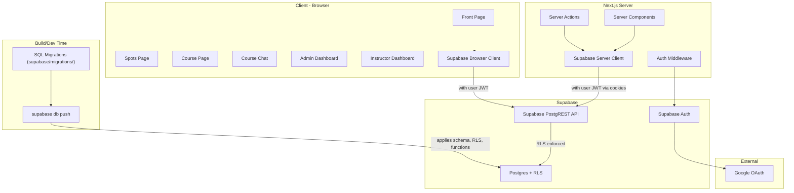
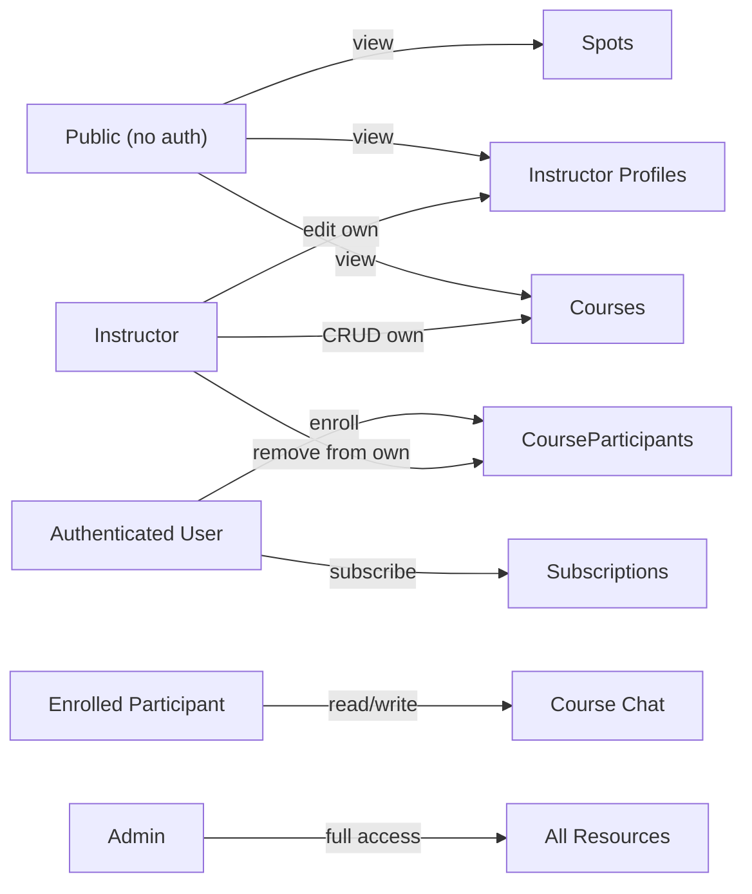
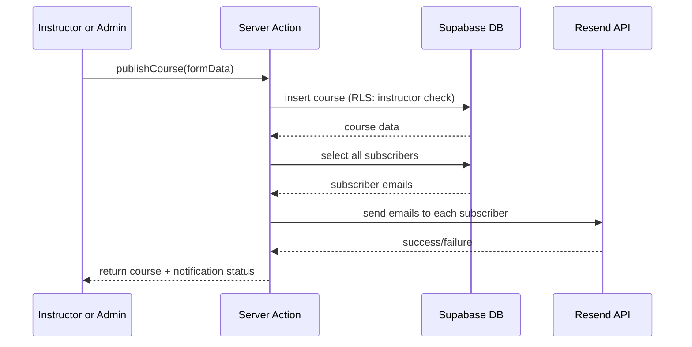

# Ålesund Kiteklubb -- Full Stack Implementation Plan

## Introduction

A web application for Ålesund Kiteklubb — a local kite club on the west coast of Norway. The site serves three audiences: the general public, enrolled members, and club staff.

Visitors can browse a curated guide of kite spots around the Ålesund area, each with wind direction, skill level, water type, and links to live weather and maps. They can also explore available courses, read about the instructors, and sign up for a newsletter.

Authenticated users (via Google login) can enroll in courses and, once enrolled, participate in a private per-course chat for communication with their instructor and fellow participants.

Instructors manage their own profile and courses — creating, editing, and removing scheduled courses, and overseeing their participant lists.

Admins have full control over the site: managing all spots, courses, instructors, users, and newsletter subscribers.

---

## Table of Contents

- [Tech Stack](#tech-stack)
  - [Key Architectural Principle](#key-architectural-principle)
- [Architecture Overview](#architecture-overview)
- [1. Project Scaffolding](#1-project-scaffolding)
- [2. Database Schema (SQL Migrations)](#2-database-schema-sql-migrations)
  - [2a. Users](#2a-users)
  - [2b. Instructors](#2b-instructors)
  - [2c. Courses](#2c-courses)
  - [2d. Course Participants](#2d-course-participants)
  - [2e. Messages](#2e-messages)
  - [2f. Subscriptions](#2f-subscriptions)
  - [2g. Spots](#2g-spots)
  - [2h. Supabase Storage (buckets + RLS)](#2h-supabase-storage-buckets--rls)
  - [RLS Policies](#rls-policies-defined-in-migration-0002)
  - [Reading roles from JWT in RLS policies](#reading-roles-from-jwt-in-rls-policies-no-subqueries)
  - [Chat-related RLS](#chat-related-rls-users-and-course_participants)
  - [Supabase DB Trigger for User Sync](#supabase-db-trigger-for-user-sync)
  - [Custom JWT Claims (Auth Hook)](#custom-jwt-claims-auth-hook)
  - [Realtime Publication](#realtime-publication-migration-0005)
  - [Atomic Promote/Demote Functions (RPC)](#atomic-promotedemote-functions-rpc)
- [3. Authentication](#3-authentication)
  - [3a. Supabase Auth Setup](#3a-supabase-auth-setup)
  - [3b. Auth Callback Route](#3b-auth-callback-route-srcappauthcallbackroutets)
  - [3c. Middleware](#3c-middleware-srcmiddlewarets)
  - [3d. Auth Helpers](#3d-auth-helpers)
- [4. Authorization Model](#4-authorization-model)
- [5. Pages and Routes](#5-pages-and-routes)
  - [5a. Front Page](#5a-front-page-srcapppagetsx----static-feel)
  - [5b. Spots Listing Page](#5b-spots-listing-page-srcappspotspagetsx)
  - [5b-ii. Spot Detail Page](#5b-ii-spot-detail-page-srcappspotsidpagetsx)
  - [5c. Courses](#5c-courses-srcappcoursespagetsx----single-page-scroll)
  - [5d. Course Chat](#5d-course-chat-srcappcoursesidchatpagetsx)
  - [5e. Admin Dashboard](#5e-admin-dashboard-srcappadminpagetsx----single-page-tabbed)
  - [5f. Instructor Dashboard](#5f-instructor-dashboard-srcappinstructorpagetsx----single-page-tabbed)
  - [5g. Auth Pages](#5g-auth-pages)
- [6. Server Actions and Data Access (all via Supabase SDK)](#6-server-actions-and-data-access-all-via-supabase-sdk)
  - [Server Actions](#server-actions-srclibactions)
  - [Database Mutation Logging](#database-mutation-logging-srclibloggerts)
  - [Data Queries](#data-queries-srclibqueries)
  - [Client-side Queries and Realtime](#client-side-queries-and-realtime)
  - [Service Role Client](#service-role-client-srclibsupabaseadmints)
- [7. Email Notifications (Resend)](#7-email-notifications-resend)
  - [Flow](#flow)
  - [Implementation](#implementation-srclibactionscoursests)
  - [Enrollment Confirmation Email](#enrollment-confirmation-email)
  - [Course Cancellation Email](#course-cancellation-email)
  - [Email Setup](#email-setup)
- [8. UI Components](#8-ui-components)
  - [Loading, Error & Toast UI](#loading-error--toast-ui)
- [9. Design System](#9-design-system)
- [10. Deployment](#10-deployment)
- [File Structure Overview](#file-structure-overview)
  - [Migration Workflow](#migration-workflow)
- [Manual Setup Steps (Checklist)](#manual-setup-steps-checklist)

---

## Tech Stack

- **Framework:** Next.js 15 (App Router, TypeScript)
- **Database:** Supabase Postgres
- **Schema & Migrations:** Pure SQL migration files in `supabase/migrations/`, applied via Supabase CLI (`supabase db push`)
- **Runtime Data Access:** Supabase JS SDK (`@supabase/supabase-js` + `@supabase/ssr`) for ALL reads and writes
- **Auth:** Supabase Auth (Google OAuth provider)
- **Styling:** Tailwind CSS v4 + shadcn/ui
- **Deployment:** Vercel

### Key Architectural Principle

**SQL migrations vs Supabase SDK -- separation of concerns:**

- **SQL migrations** (`supabase/migrations/`) define all database structure: tables, enums, RLS policies, triggers, auth hooks, RPC functions, storage buckets. These are hand-written SQL files applied via `supabase db push`. This gives full control over Postgres features with a single migration system and no extra dependencies.
- **Supabase SDK** is the runtime data access layer. All queries (select, insert, update, delete) from both server and client components go through the Supabase client. This ensures RLS policies are enforced automatically, since the Supabase client passes the user's JWT to Postgres.

---

## Architecture Overview




---

## 1. Project Scaffolding

Initialize Next.js 15 with TypeScript, Tailwind CSS, App Router, and `src/` directory:

```bash
npx create-next-app@latest . --typescript --tailwind --app --src-dir --use-pnpm
```

Install core dependencies:

```bash
# Runtime: Supabase SDK for all data access + Resend for email + React Email for templates + Sonner for toast notifications + Zod for validation
pnpm add @supabase/supabase-js @supabase/ssr resend @react-email/components sonner zod

# Supabase CLI for migrations and type generation
pnpm add -D supabase

# UI
pnpm dlx shadcn@latest init
```

Key config files to create:

- `src/lib/supabase/client.ts` -- Browser Supabase client (`createBrowserClient<Database>()` — import `Database` from `@/types/database` for full type inference)
- `src/lib/supabase/server.ts` -- Server Supabase client (createServerClient with cookies). **Next.js 15 breaking change:** `cookies()` is now async -- `createClient()` must be an `async` function that `await`s `cookies()` before passing them to `createServerClient`. **`@supabase/ssr` ≥ 0.5 breaking change:** The individual `get`/`set`/`remove` cookie methods are deprecated — use only `getAll`/`setAll`.
- `src/lib/supabase/middleware.ts` -- Auth session refresh helper (uses `request.cookies`/`response.cookies` from NextRequest/NextResponse — **not** `cookies()` from `next/headers`)
- `next.config.ts` -- Configure `images.remotePatterns` to allow the Supabase Storage domain so `next/image` (`<Image>`) can optimize remote images: `{ protocol: 'https', hostname: '<project-ref>.supabase.co', pathname: '/storage/v1/object/public/**' }`
- `.env.local.example` -- Template for required env vars

**Reference implementation — `src/lib/supabase/server.ts`:**

```ts
// src/lib/supabase/server.ts
import { createServerClient } from '@supabase/ssr'
import { cookies } from 'next/headers'
import type { Database } from '@/types/database'

export async function createClient() {
  const cookieStore = await cookies()   // Next.js 15: cookies() is async

  return createServerClient<Database>(
    process.env.NEXT_PUBLIC_SUPABASE_URL!,
    process.env.NEXT_PUBLIC_SUPABASE_ANON_KEY!,
    {
      cookies: {
        getAll() {
          return cookieStore.getAll()
        },
        setAll(cookiesToSet) {
          try {
            cookiesToSet.forEach(({ name, value, options }) =>
              cookieStore.set(name, value, options)
            )
          } catch {
            // setAll is called from Server Components where cookies are read-only.
            // This is safe to ignore — the middleware handles session refresh.
          }
        },
      },
    }
  )
}
```

**Key details:**
- `cookies()` is `await`ed once, stored in `cookieStore`, then referenced inside the `getAll`/`setAll` callbacks.
- `setAll` has a `try/catch` because `cookieStore.set()` throws in Server Components (read-only context). This is safe because the middleware handles session refresh.
- Do NOT use the deprecated `get`/`set`/`remove` individual cookie methods — `@supabase/ssr` ≥ 0.5 requires only `getAll`/`setAll`.

Environment variables needed:

- `NEXT_PUBLIC_SUPABASE_URL` -- Supabase project URL (used by Supabase SDK at runtime)
- `NEXT_PUBLIC_SUPABASE_ANON_KEY` -- Supabase anon key (used by Supabase SDK at runtime)
- `SUPABASE_SERVICE_ROLE_KEY` -- Service role key (server-only, bypasses RLS for admin operations like role changes)
- `RESEND_API_KEY` -- Resend API key (server-only, for sending subscriber notification emails)
- `RESEND_FROM_EMAIL` -- FROM address for emails (default `onboarding@resend.dev` for dev; production must set to a verified domain address, e.g. `noreply@aalesundkiteklubb.no`)
- `NEXT_PUBLIC_SITE_URL` -- Full origin of the app (e.g. `https://aalesundkiteklubb.no` in production, `http://localhost:3000` in dev). Used for OAuth redirect URLs in Supabase dashboard: add `{NEXT_PUBLIC_SITE_URL}/auth/callback` as an authorized redirect for Google OAuth.

---

## 2. Database Schema (SQL Migrations)

All database objects (tables, enums, RLS policies, triggers, functions, storage) are defined as hand-written SQL migration files in `supabase/migrations/`. Migrations are applied via `supabase db push`. All column names use snake_case (e.g. `avatar_url`, `user_id`, `instructor_id`) for consistency with Supabase SDK and triggers.

**Timezone convention:** All timestamp columns use `timestamptz` (not `timestamp`). Postgres stores them as UTC internally. The application always interprets and displays them in `Europe/Oslo` using the shared date formatting utilities in `src/lib/utils/date.ts` (see Section 9). Never use raw `.toLocaleDateString()` or `.toLocaleString()` without explicitly passing `{ timeZone: 'Europe/Oslo' }`.

The migration files follow this structure:

| Migration | Contents |
|-----------|----------|
| `0001_initial_schema.sql` | CREATE TYPE enums, CREATE TABLE for all 7 tables |
| `0002_rls_policies.sql` | All RLS policies for all tables |
| `0003_user_sync_trigger.sql` | Triggers on auth.users to auto-create and auto-delete public.users |
| `0004_custom_jwt_hook.sql` | Auth hook to inject role into JWT claims |
| `0005_realtime_messages.sql` | ALTER PUBLICATION for Realtime on messages |
| `0006_storage_buckets.sql` | spot-maps + instructor-photos buckets, storage.objects RLS |
| `0007_promote_demote_rpcs.sql` | promote_to_instructor, promote_to_admin, demote_to_user, demote_admin_to_instructor RPCs |

### 2a. Users

Synced from Supabase Auth automatically via DB trigger (migration 0003). The auth callback upsert (Section 3b) acts as a safety net and refreshes profile fields on each login.

All column names use snake_case (e.g. `avatar_url`, `created_at`).

| Column     | Type          | Notes                         |
| ---------- | ------------- | ----------------------------- |
| id         | uuid PK       | Matches `auth.users.id` (no default — set from `auth.users.id` by trigger) |
| email      | text NOT NULL |                               |
| name       | text          |                               |
| avatar_url | text          |                               |
| role       | enum          | `user`, `instructor`, `admin` |
| created_at | timestamptz   | default now()                 |


### 2b. Instructors


| Column           | Type      | Notes                   |
| ---------------- | --------- | ----------------------- |
| id               | uuid PK   | default gen_random_uuid |
| user_id          | uuid FK   | -> users.id, unique, ON DELETE CASCADE |
| bio              | text      |                         |
| certifications   | text      | e.g. "IKO Level 2"      |
| years_experience | integer   |                         |
| phone            | text      |                         |
| photo_url        | text      | Supabase Storage public URL from `instructor-photos` bucket |
| created_at       | timestamptz | default now()           |

**Sync invariant:** Users with `role = 'instructor'` or `role = 'admin'` always have a row in `instructors`. Admins automatically get an instructor profile when promoted (so they can create courses using the same UI). These are created atomically via admin actions (see section 6). The JWT claim (`user_role`) handles fast permission checks (middleware, UI). The `instructors` table holds profile data and provides the FK for `courses.instructor_id`.


### 2c. Courses


| Column           | Type          | Notes                                 |
| ---------------- | ------------- | ------------------------------------- |
| id               | uuid PK       | default gen_random_uuid               |
| title            | text NOT NULL |                                       |
| description      | text          |                                       |
| price            | integer       | In NOK (e.g. 500 kr)                  |
| start_time       | timestamptz NOT NULL | Course start (date + time). Stored with timezone; compare using Oslo-aware midnight for future-course filter (see queries section) |
| end_time         | timestamptz NOT NULL | Course end (same day). Must be > `start_time`. DB CHECK constraint: `end_time > start_time` |
| max_participants | integer       | nullable = unlimited                  |
| instructor_id    | uuid FK       | -> instructors.id, nullable, ON DELETE SET NULL |
| spot_id          | uuid FK       | -> spots.id, nullable, ON DELETE SET NULL |
| created_at       | timestamptz   | default now()                         |


### 2d. Course Participants


| Column      | Type      | Notes         |
| ----------- | --------- | ------------- |
| id          | uuid PK   | default gen_random_uuid |
| user_id     | uuid FK NOT NULL | -> users.id, ON DELETE CASCADE   |
| course_id   | uuid FK NOT NULL | -> courses.id, ON DELETE CASCADE |
| enrolled_at | timestamptz | default now() |


Unique constraint on (user_id, course_id). The unique constraint prevents duplicate enrollment at the database level (Postgres error 23505).

Enrollment is handled via a direct SDK insert in the server action. Capacity is checked application-side before inserting; the unique constraint prevents duplicates. No Postgres RPC function is needed — the theoretical race condition (two users passing the capacity check simultaneously) is negligible at this scale and the consequence is trivial (one extra participant).

### 2e. Messages


| Column     | Type          | Notes         |
| ---------- | ------------- | ------------- |
| id         | uuid PK       | default gen_random_uuid |
| user_id    | uuid FK       | -> users.id, nullable, ON DELETE SET NULL (shows "Slettet bruker" in chat) |
| course_id  | uuid FK NOT NULL | -> courses.id, ON DELETE CASCADE |
| content    | text NOT NULL |               |
| created_at | timestamptz   | default now() |


### 2f. Subscriptions


| Column             | Type          | Notes                |
| ------------------ | ------------- | -------------------- |
| id                 | uuid PK       | default gen_random_uuid |
| user_id            | uuid FK NOT NULL | -> users.id, **unique**, ON DELETE CASCADE |
| email              | text NOT NULL | Auto-filled from the user's Google auth email. One subscription per user (`user_id` UNIQUE). |
| created_at         | timestamptz   | default now()        |


### 2g. Spots


| Column         | Type          | Notes                                                      |
| -------------- | ------------- | ---------------------------------------------------------- |
| id             | uuid PK       | default gen_random_uuid                                    |
| name           | text NOT NULL |                                                            |
| description    | text          | "Om spotten" text                                          |
| season         | enum          | `summer`, `winter` (SommerSpotter / VinterSpotter)         |
| area           | text NOT NULL | Grouping for filtering (e.g. "Giske", "Ålesund"). Free text. Admin form uses a Combobox that suggests existing area values from other spots (typed text filters the list). Selecting autofills the field; typing a new value uses it as-is. Used for area filter on listing page. |
| wind_directions | text[]        | Array of compass strings: "N","NE","E","SE","S","SW","W","NW" |
| map_image_url   | text          | Supabase Storage public URL from `spot-maps` bucket         |
| latitude        | numeric       | For Yr link and Google Maps link                           |
| longitude       | numeric       | For Yr link and Google Maps link                           |
| skill_level     | enum          | `beginner`, `experienced`                                  |
| skill_notes     | text          | e.g. "Du må kunne ta høyde, ikke veldig langgrunt"         |
| water_type      | text[]        | Array: "chop", "flat", "waves"                             |
| created_at      | timestamptz   | default now()                                              |

Yr and Google Maps links are generated dynamically from `latitude`/`longitude` (no stored URLs needed). **When `latitude` or `longitude` is null:** hide the Værmelding and Veibeskrivelse sections, or show a placeholder message (e.g. "Kartlenker ikke tilgjengelig").


### 2h. Supabase Storage (buckets + RLS)

Image uploads use two public buckets. Buckets and `storage.objects` RLS policies are defined in migration `0006`.

**Bucket: `spot-maps`**
- **Purpose:** Admin-uploaded annotated map/satellite images for spots
- **Path:** `{spotId}/{filename}` (e.g. `abc-123/map.jpg`)
- **RLS on storage.objects:**
  - SELECT: Public (allow all for `bucket_id = 'spot-maps'`)
  - INSERT/UPDATE/DELETE: Admin only (`(current_setting('request.jwt.claims', true)::jsonb)->>'user_role' = 'admin'`)

**Bucket: `instructor-photos`**
- **Purpose:** Instructor profile photos (instructors and admins upload their own)
- **Path:** `{userId}/{filename}` (e.g. `abc-123/photo.jpg`) — first path segment must match `auth.uid()`
- **RLS on storage.objects:**
  - SELECT: Public (allow all for `bucket_id = 'instructor-photos'`)
  - INSERT: Authenticated with role instructor or admin, and `(storage.foldername(name))[1] = auth.uid()::text`
  - UPDATE/DELETE: Same path constraint (own folder only)
- **No cross-user uploads:** Storage RLS enforces that each instructor/admin can only upload to their own folder (`auth.uid()`). The admin dashboard does not expose instructor profile editing — admins manage roles (promote/demote) only. Each instructor manages their own profile and photo via the Instructor dashboard.

**Migration `0006`** creates the buckets and RLS policies. Full SQL:

```sql
-- Create buckets (5MB for spot-maps, 2MB for instructor-photos; jpeg, png, webp)
INSERT INTO storage.buckets (id, name, public, file_size_limit, allowed_mime_types) VALUES
  ('spot-maps', 'spot-maps', true, 5242880, ARRAY['image/jpeg','image/png','image/webp']),
  ('instructor-photos', 'instructor-photos', true, 2097152, ARRAY['image/jpeg','image/png','image/webp']);

-- spot-maps: public read; admin-only write (separate policies per operation, matching instructor-photos pattern)
CREATE POLICY "spot-maps public read" ON storage.objects
  FOR SELECT TO public USING (bucket_id = 'spot-maps');
CREATE POLICY "spot-maps admin insert" ON storage.objects
  FOR INSERT TO authenticated WITH CHECK (
    bucket_id = 'spot-maps' AND
    (current_setting('request.jwt.claims', true)::jsonb)->>'user_role' = 'admin'
  );
CREATE POLICY "spot-maps admin update" ON storage.objects
  FOR UPDATE TO authenticated USING (
    bucket_id = 'spot-maps' AND
    (current_setting('request.jwt.claims', true)::jsonb)->>'user_role' = 'admin'
  );
CREATE POLICY "spot-maps admin delete" ON storage.objects
  FOR DELETE TO authenticated USING (
    bucket_id = 'spot-maps' AND
    (current_setting('request.jwt.claims', true)::jsonb)->>'user_role' = 'admin'
  );

-- instructor-photos: public read; instructor/admin upload to own folder; update/delete own folder only
CREATE POLICY "instructor-photos public read" ON storage.objects
  FOR SELECT TO public USING (bucket_id = 'instructor-photos');
CREATE POLICY "instructor-photos authenticated upload" ON storage.objects
  FOR INSERT TO authenticated WITH CHECK (
    bucket_id = 'instructor-photos' AND
    (current_setting('request.jwt.claims', true)::jsonb)->>'user_role' IN ('instructor','admin') AND
    (storage.foldername(name))[1] = auth.uid()::text
  );
CREATE POLICY "instructor-photos own folder update" ON storage.objects
  FOR UPDATE TO authenticated USING (
    bucket_id = 'instructor-photos' AND (storage.foldername(name))[1] = auth.uid()::text
  )
  WITH CHECK (
    bucket_id = 'instructor-photos' AND (storage.foldername(name))[1] = auth.uid()::text
  );
CREATE POLICY "instructor-photos own folder delete" ON storage.objects
  FOR DELETE TO authenticated USING (
    bucket_id = 'instructor-photos' AND (storage.foldername(name))[1] = auth.uid()::text
  );
```

**Upload flow:** Server Actions call `supabase.storage.from(bucket).upload(path, file)`, then `getPublicUrl(path)` to obtain the URL stored in `instructors.photo_url` or `spots.map_image_url`.

**New spot creation with map:** Since the bucket path requires `spotId`, for a new spot: (1) Create the spot row first (without `map_image_url`), (2) Upload image to `spot-maps/{newSpotId}/{filename}`, (3) Update the spot with `map_image_url`. For edits, use the existing `spotId` directly. When creating a spot without a map, omit steps 2–3; `map_image_url` remains null. **Error handling:** If step 2 or 3 fails (e.g. upload error, network failure), delete the newly created spot row and return an error to the admin. Do not leave a spot without a map in a partial state.


### RLS Policies (defined in migration `0002`)

RLS is the primary authorization mechanism. All policies are written as `CREATE POLICY` SQL statements in `supabase/migrations/0002_rls_policies.sql`. Each table must have `ALTER TABLE ... ENABLE ROW LEVEL SECURITY;` before its policies.

Example pattern used across all tables:

```sql
ALTER TABLE public.courses ENABLE ROW LEVEL SECURITY;

CREATE POLICY "Public can view courses" ON public.courses
  FOR SELECT TO anon USING (true);

CREATE POLICY "Authenticated can view courses" ON public.courses
  FOR SELECT TO authenticated USING (true);

CREATE POLICY "Instructors can insert own courses" ON public.courses
  FOR INSERT TO authenticated WITH CHECK (
    instructor_id IN (SELECT id FROM public.instructors WHERE user_id = auth.uid())
  );

CREATE POLICY "Instructors can update own courses" ON public.courses
  FOR UPDATE TO authenticated USING (
    instructor_id IN (SELECT id FROM public.instructors WHERE user_id = auth.uid())
  );
```

### Reading roles from JWT in RLS policies (no subqueries)

Since the Custom JWT Claims Hook (migration `0004`) injects `user_role` into the token, all RLS policies that check roles should read directly from the JWT instead of querying the `users` table. This is instant -- no table access needed.

```sql
-- Helper expressions (reuse across all policies that check role)
-- isAdmin:
(current_setting('request.jwt.claims', true)::jsonb)->>'user_role' = 'admin'
-- isInstructor:
(current_setting('request.jwt.claims', true)::jsonb)->>'user_role' = 'instructor'
```

Admin bypass policy (added to every table where admins need full access):

```sql
CREATE POLICY "Admin full access" ON public.<table>
  FOR ALL TO authenticated
  USING ((current_setting('request.jwt.claims', true)::jsonb)->>'user_role' = 'admin')
  WITH CHECK ((current_setting('request.jwt.claims', true)::jsonb)->>'user_role' = 'admin');
```

**Role vs ownership:** Use JWT claims for role checks (who can perform which action type). For ownership checks (e.g. does this course belong to the current instructor), use the `instructors` table subquery — do not subquery the `users` table for role. The Courses policies (e.g. "Instructors can insert own courses") correctly use `instructor_id IN (SELECT id FROM instructors WHERE user_id = auth.uid())` to verify ownership.

**Per-table policy checklist:**

Every policy below MUST be written as a `CREATE POLICY` statement in `supabase/migrations/0002_rls_policies.sql`. Use the JWT claim expressions (see above) for role checks — never subquery `users` for role. The "Admin full access" policy should be added to every table where admin access is listed.

**Users table** — 4 policies:

1. `"Users can read own profile"` — SELECT, `authenticated`, using: `id = auth.uid()`
2. `"Co-participants can read profile fields"` — SELECT, `authenticated`, using: EXISTS subquery on `course_participants` (see Chat-related RLS section below for SQL)
3. `"Instructors can read users in own courses"` — SELECT, `authenticated`, using: EXISTS subquery joining `course_participants → courses → instructors` where `instructors.user_id = auth.uid()` (see Chat-related RLS section below for SQL). Required for: chat profile enrichment, participant list display, and cancellation email fetching by instructors.
4. `"Admin full access"` — ALL, `authenticated`, using/withCheck: JWT `user_role = 'admin'`

**Note:** INSERT for new users is handled by the DB trigger (migration 0003). The auth callback upsert (service role) acts as a safety net and refreshes profile fields on each login (see Section 3b). UPDATE/DELETE for role changes are handled by admins via RPC (promote_to_instructor, etc.) using the regular server client.

**Instructors table** — 4 policies:

1. `"Public can view instructor profiles"` — SELECT, `anon`, using: `true`
2. `"Authenticated can view instructor profiles"` — SELECT, `authenticated`, using: `true`
3. `"Instructors can update own profile"` — UPDATE, `authenticated`, using: `user_id = auth.uid()`, withCheck: `user_id = auth.uid()`
4. `"Admin full access"` — ALL, `authenticated`, using/withCheck: JWT `user_role = 'admin'`

**Courses table** — 6 policies:

1. `"Public can view courses"` — SELECT, `anon`, using: `true`
2. `"Authenticated can view courses"` — SELECT, `authenticated`, using: `true`
3. `"Instructors can insert own courses"` — INSERT, `authenticated`, withCheck: `instructor_id IN (SELECT id FROM instructors WHERE user_id = auth.uid())`
4. `"Instructors can update own courses"` — UPDATE, `authenticated`, using: same instructor subquery, withCheck: same instructor subquery (prevents reassigning `instructor_id` to another instructor)
5. `"Instructors can delete own courses"` — DELETE, `authenticated`, using: same instructor subquery
6. `"Admin full access"` — ALL, `authenticated`, using/withCheck: JWT `user_role = 'admin'`

**Course Participants table** — 7 policies:

1. `"Users can view own enrollments"` — SELECT, `authenticated`, using: `user_id = auth.uid()`
2. `"Instructors can view their course participants"` — SELECT, `authenticated`, using: `course_id IN (SELECT id FROM courses WHERE instructor_id IN (SELECT id FROM instructors WHERE user_id = auth.uid()))`
3. `"Participants can see co-participants in same course"` — SELECT, `authenticated`, using: EXISTS subquery (see Chat-related RLS section below for SQL)
4. `"Users can enroll themselves"` — INSERT, `authenticated`, withCheck: `user_id = auth.uid()`
5. `"Users can unenroll themselves"` — DELETE, `authenticated`, using: `user_id = auth.uid()`
6. `"Instructors can remove participants from their courses"` — DELETE, `authenticated`, using: `course_id IN (SELECT id FROM courses WHERE instructor_id IN (SELECT id FROM instructors WHERE user_id = auth.uid()))`
7. `"Admin full access"` — ALL, `authenticated`, using/withCheck: JWT `user_role = 'admin'`

**Messages table** — 5 policies:

1. `"Course participants can read messages"` — SELECT, `authenticated`, using: `course_id IN (SELECT course_id FROM course_participants WHERE user_id = auth.uid())`
2. `"Instructors can read messages in own courses"` — SELECT, `authenticated`, using: `course_id IN (SELECT id FROM courses WHERE instructor_id IN (SELECT id FROM instructors WHERE user_id = auth.uid()))`
3. `"Course participants can send messages"` — INSERT, `authenticated`, withCheck: `user_id = auth.uid() AND course_id IN (SELECT course_id FROM course_participants WHERE user_id = auth.uid())`
4. `"Instructors can send messages in own courses"` — INSERT, `authenticated`, withCheck: `user_id = auth.uid() AND course_id IN (SELECT id FROM courses WHERE instructor_id IN (SELECT id FROM instructors WHERE user_id = auth.uid()))`
5. `"Admin full access"` — ALL, `authenticated`, using/withCheck: JWT `user_role = 'admin'`

**Subscriptions table** — 4 policies:

1. `"Users can view own subscription"` — SELECT, `authenticated`, using: `user_id = auth.uid()`
2. `"Users can create own subscription"` — INSERT, `authenticated`, withCheck: `user_id = auth.uid()`
3. `"Users can delete own subscription"` — DELETE, `authenticated`, using: `user_id = auth.uid()`
4. `"Admin full access"` — ALL, `authenticated`, using/withCheck: JWT `user_role = 'admin'`

**Note:** Subscription email is always the user's Google auth email. To change notification email, the user must update their Google account.

**Spots table** — 3 policies:

1. `"Public can view spots"` — SELECT, `anon`, using: `true`
2. `"Authenticated can view spots"` — SELECT, `authenticated`, using: `true`
3. `"Admin full access"` — ALL, `authenticated`, using/withCheck: JWT `user_role = 'admin'`

**Total: 33 policies** across 7 tables. All written as `CREATE POLICY` SQL in migration `0002`.

### Chat-related RLS (users and course_participants)

Chat needs to display other participants' names and avatars. Instructors also need to read participant profiles for participant lists and cancellation emails. Add these policies in migration `0002`:

**Users** — co-participant read (for chat profile enrichment):

```sql
CREATE POLICY "Co-participants can read profile fields" ON public.users
  FOR SELECT TO authenticated USING (
    EXISTS (
      SELECT 1 FROM public.course_participants cp1
      WHERE cp1.user_id = auth.uid()
      AND EXISTS (
        SELECT 1 FROM public.course_participants cp2
        WHERE cp2.course_id = cp1.course_id AND cp2.user_id = users.id
      )
    )
  );
```

**Users** — instructor read (for participant lists, chat profile enrichment, cancellation emails):

```sql
CREATE POLICY "Instructors can read users in own courses" ON public.users
  FOR SELECT TO authenticated USING (
    EXISTS (
      SELECT 1 FROM public.course_participants cp
      JOIN public.courses c ON c.id = cp.course_id
      JOIN public.instructors i ON i.id = c.instructor_id
      WHERE i.user_id = auth.uid() AND cp.user_id = users.id
    )
  );
```

**Course participants** — participant list read (enables pre-fetch for chat):

```sql
CREATE POLICY "Participants can see co-participants in same course" ON public.course_participants
  FOR SELECT TO authenticated USING (
    EXISTS (
      SELECT 1 FROM public.course_participants my
      WHERE my.user_id = auth.uid() AND my.course_id = course_participants.course_id
    )
  );
```

### Supabase DB Trigger for User Sync

Postgres trigger functions on `auth.users` that keep `public.users` in sync. An AFTER INSERT trigger auto-creates a `public.users` row on signup; an AFTER DELETE trigger removes it on account deletion (cascading to `course_participants`, `subscriptions`, etc. via FK constraints). Migration `0003` contains:

```sql
create or replace function public.handle_new_user()
returns trigger language plpgsql security definer as $$
begin
  insert into public.users (id, email, name, avatar_url, role)
  values (
    new.id,
    new.email,
    new.raw_user_meta_data->>'full_name',
    new.raw_user_meta_data->>'avatar_url',
    'user'
  );
  return new;
end;
$$;

create trigger on_auth_user_created
  after insert on auth.users
  for each row execute function public.handle_new_user();

-- Cleanup trigger: when a user is deleted from auth.users, remove the public.users row.
-- FK cascades handle dependents: course_participants (CASCADE), subscriptions (CASCADE),
-- messages.user_id (SET NULL → shows "Slettet bruker" in chat), courses.instructor_id (SET NULL).
create or replace function public.handle_user_deleted()
returns trigger language plpgsql security definer as $$
begin
  delete from public.users where id = old.id;
  return old;
end;
$$;

create trigger on_auth_user_deleted
  after delete on auth.users
  for each row execute function public.handle_user_deleted();
```

**Timing:** The trigger runs synchronously in the same transaction as the `auth.users` insert. When Supabase commits the new user, both `auth.users` and `public.users` exist. The redirect to our callback happens after that commit, so when our callback runs, the trigger has already completed.

### Custom JWT Claims (Auth Hook)

A Supabase Auth Hook ("Custom Access Token") injects the user's `role` from `public.users` directly into the JWT. This is a Postgres function that runs every time a token is issued/refreshed. **Must be `SECURITY DEFINER`** because the hook is invoked by `supabase_auth_admin` with no `auth.uid()` context and no JWT claims — without it, RLS on `public.users` would block the `SELECT role` query for every user, causing the fallback to always set `user_role = 'user'` regardless of actual role:

```sql
create or replace function public.custom_access_token_hook(event jsonb)
returns jsonb language plpgsql security definer set search_path = public as $$
declare
  user_role text;
begin
  select role into user_role from public.users where id = (event->>'user_id')::uuid;
  if user_role is not null then
    event := jsonb_set(event, '{claims,user_role}', to_jsonb(user_role));
  else
    event := jsonb_set(event, '{claims,user_role}', '"user"');
  end if;
  return event;
exception when others then
  -- Graceful degradation: if anything fails (missing table, bad cast, transient error),
  -- fall back to least-privileged role instead of crashing the entire auth flow.
  -- Without this, an unhandled exception propagates to Supabase Auth and blocks
  -- token issuance for ALL users, not just the affected one.
  event := jsonb_set(event, '{claims,user_role}', '"user"');
  return event;
end;
$$;

-- Required grants: supabase_auth_admin must be able to call the hook and read users.role
grant usage on schema public to supabase_auth_admin;
grant execute on function public.custom_access_token_hook to supabase_auth_admin;
revoke execute on function public.custom_access_token_hook from authenticated, anon, public;
grant all on table public.users to supabase_auth_admin;
```

After this, every access token issued by Supabase contains `user_role` as a top-level JWT claim. **Important:** this claim is NOT in `user.app_metadata` — it lives in the raw JWT payload. To read it on the JS side, decode the access token from the session using an Edge-safe helper (Next.js middleware runs in the Edge Runtime, which has no `Buffer`):

```typescript
// src/lib/auth/decode-jwt.ts — Edge-safe JWT payload decoder
export function decodeJwtPayload(token: string): Record<string, unknown> {
  const base64Url = token.split('.')[1];
  const base64 = base64Url.replace(/-/g, '+').replace(/_/g, '/');
  const padded = base64.padEnd(base64.length + (4 - base64.length % 4) % 4, '=');
  return JSON.parse(atob(padded));
}

// Usage:
const { data: { session } } = await supabase.auth.getSession();
const jwt = decodeJwtPayload(session.access_token);
const role = jwt.user_role; // 'user' | 'instructor' | 'admin'
```

**Why not plain `atob()`?** JWTs use base64url encoding (`-` and `_` instead of `+` and `/`, no padding). Raw `atob()` will throw on tokens containing those characters. The helper converts base64url → base64 before decoding. **Why not `Buffer.from()`?** The Edge Runtime has no `Buffer` — `atob()` with conversion is the correct portable approach.

`supabase.auth.getUser()` returns the user object from the Auth API — it does **not** include custom JWT claims injected by hooks. Always use `getSession()` + token decode for role checks.

In Supabase Dashboard > Authentication > Hooks, add a Custom Access Token hook and configure it to invoke `public.custom_access_token_hook` (the function is created by migration 0004). See Manual Setup step 7.

**Trade-off:** When an admin changes a user's role, the JWT updates on next token refresh (~1 hour) or on re-login. For rare admin operations this is acceptable.

### Realtime Publication (migration 0005)

Add the `messages` table to the Supabase Realtime publication so the course chat receives live inserts:

```sql
ALTER PUBLICATION supabase_realtime ADD TABLE public.messages;
```

**Note:** The publication name `supabase_realtime` is the default for hosted Supabase projects. If your project uses a different publication, verify in Supabase Dashboard > Database > Replication.

### Atomic Promote/Demote Functions (RPC)

Postgres RPC functions that atomically update both `instructors` and `users.role` in a single transaction. The Supabase JS SDK has no client-side transaction API for multi-statement operations, so these RPCs are required. Defined in migration `0007`.

```sql
create or replace function public.promote_to_instructor(p_user_id uuid)
returns void language plpgsql security invoker as $$
declare
  current_role text;
begin
  if (current_setting('request.jwt.claims', true)::jsonb)->>'user_role' != 'admin' then
    raise exception 'Only admins can promote users';
  end if;

  -- Prevent downgrading an admin through the promote path
  -- (bypasses the last-admin guard in demote_to_user)
  select role into current_role from users where id = p_user_id;
  if current_role = 'admin' then
    raise exception 'Cannot change an admin role via promotion';
  end if;

  insert into instructors (user_id) values (p_user_id)
    on conflict (user_id) do nothing;
  update users set role = 'instructor' where id = p_user_id;
end;
$$;

create or replace function public.promote_to_admin(p_user_id uuid)
returns void language plpgsql security invoker as $$
begin
  if (current_setting('request.jwt.claims', true)::jsonb)->>'user_role' != 'admin' then
    raise exception 'Only admins can promote users';
  end if;
  insert into instructors (user_id) values (p_user_id)
    on conflict (user_id) do nothing;
  update users set role = 'admin' where id = p_user_id;
end;
$$;

create or replace function public.demote_to_user(p_user_id uuid)
returns void language plpgsql security invoker as $$
declare
  admin_count int;
begin
  if (current_setting('request.jwt.claims', true)::jsonb)->>'user_role' != 'admin' then
    raise exception 'Only admins can demote users';
  end if;

  -- Prevent self-demotion
  if p_user_id = auth.uid() then
    raise exception 'Cannot demote yourself';
  end if;

  -- Prevent removing the last admin
  select count(*) into admin_count from users where role = 'admin';
  if admin_count <= 1 and exists (select 1 from users where id = p_user_id and role = 'admin') then
    raise exception 'Cannot demote the last admin';
  end if;

  delete from instructors where user_id = p_user_id;
  update users set role = 'user' where id = p_user_id;
end;
$$;

create or replace function public.demote_admin_to_instructor(p_user_id uuid)
returns void language plpgsql security invoker as $$
declare
  admin_count int;
begin
  if (current_setting('request.jwt.claims', true)::jsonb)->>'user_role' != 'admin' then
    raise exception 'Only admins can change roles';
  end if;

  -- Prevent self-demotion
  if p_user_id = auth.uid() then
    raise exception 'Cannot demote yourself';
  end if;

  -- Prevent removing the last admin
  select count(*) into admin_count from users where role = 'admin';
  if admin_count <= 1 and exists (select 1 from users where id = p_user_id and role = 'admin') then
    raise exception 'Cannot demote the last admin';
  end if;

  -- Only update role — preserve the existing instructors row (profile data + course ownership)
  update users set role = 'instructor' where id = p_user_id;
end;
$$;
```

Called via `supabase.rpc('promote_to_instructor', { p_user_id })`, `supabase.rpc('promote_to_admin', { p_user_id })`, `supabase.rpc('demote_to_user', { p_user_id })`, and `supabase.rpc('demote_admin_to_instructor', { p_user_id })` from the admin's server client. RLS "Admin full access" allows the updates; the JWT check provides defense in depth. `demote_to_user` includes a self-demotion guard (`'Cannot demote yourself'` → `{ success: false, error: 'Du kan ikke endre din egen rolle' }`) and a last-admin guard — if `p_user_id` is the only remaining admin, the function raises `'Cannot demote the last admin'`; the server action returns this as `{ success: false, error: 'Kan ikke fjerne siste admin' }` and the UI shows a toast. `promote_to_instructor` includes an admin-downgrade guard — if the target user is already an admin, the function raises `'Cannot change an admin role via promotion'`; the server action returns `{ success: false, error: 'Kan ikke nedgradere en admin via forfremming — bruk nedgradering først' }`. **Note:** `instructors.user_id` must have a unique constraint for `ON CONFLICT (user_id)` to work — the schema already defines `user_id` as unique.

**JWT staleness after role changes:** After a successful promote/demote, the user's JWT still contains the old `user_role` claim until the token refreshes (~1 hour). The admin dashboard should show a context-specific toast after each role change. This is a Supabase Auth limitation — `supabase.auth.refreshSession()` only works in the target user's own browser, so the admin cannot force a refresh on their behalf.

**Per-operation toast messages:**

| Operation | Toast |
|-----------|-------|
| Promote user → instructor | `toast.success('Bruker forfremmet til instruktør. De må logge ut og inn igjen for å få tilgang.')` |
| Promote user/instructor → admin | `toast.success('Bruker forfremmet til admin. De må logge ut og inn igjen for å få tilgang.')` |
| Demote instructor → user | `toast.success('Instruktør nedgradert til bruker. De må logge ut og inn igjen.')` |
| Demote admin → user | `toast.success('Admin nedgradert til bruker. De må logge ut og inn igjen.')` |
| Demote admin → instructor | `toast.success('Admin nedgradert til instruktør. De må logge ut og inn igjen.')` |
| Self-demotion attempt | `toast.error('Du kan ikke endre din egen rolle')` |
| Last-admin demotion | `toast.error('Kan ikke fjerne siste admin')` |
| Admin-downgrade via promote | `toast.error('Kan ikke nedgradere en admin via forfremming — bruk nedgradering først')` |

**Admin → instructor demotion (Brukere tab):** When the admin selects "Instruktør" for a user whose current role is `admin`, the UI must show a **confirmation dialog** before calling `demote_admin_to_instructor`: "Denne brukeren er admin. Å endre rollen til instruktør vil fjerne admin-tilgangen. Instruktør-profilen og kurstilknytninger beholdes. Vil du fortsette?" with "Avbryt" and "Bekreft" buttons. On confirm, call `demote_admin_to_instructor(userId)` (single RPC — only updates `users.role` to `'instructor'`, preserving the existing `instructors` row with all profile data and keeping `courses.instructor_id` intact). On success, show `toast.success('Admin nedgradert til instruktør. De må logge ut og inn igjen.')`.

---

## 3. Authentication

### 3a. Supabase Auth Setup

Manual configuration in two places:

**Supabase Dashboard:**
- Enable Google OAuth provider
- Add redirect URL `{NEXT_PUBLIC_SITE_URL}/auth/callback` (e.g. `https://aalesundkiteklubb.no/auth/callback`) in the Google OAuth provider settings

**Google Cloud Console:**
- Add your Supabase project's callback URL to Authorized redirect URIs in the OAuth 2.0 Client (APIs & Services > Credentials). The exact URL (e.g. `https://<project-ref>.supabase.co/auth/v1/callback`) is shown on the Supabase Dashboard > Authentication > Providers > Google page.

### 3b. Auth Callback Route (`src/app/auth/callback/route.ts`)

1. Exchange the OAuth code for a session via `supabase.auth.exchangeCodeForSession(code)`.
2. **Upsert into `public.users`** using the service role client. Build the upsert payload through a Zod schema that explicitly allows only `id`, `email`, `name`, and `avatar_url` — this structurally prevents `role` from ever being included in the upsert, so an `ON CONFLICT (id) DO UPDATE` can never overwrite the admin-managed role:
   ```ts
   // src/lib/validations/user-sync.ts
   import { z } from 'zod';

   /** Whitelist of fields allowed in the auth callback upsert.
    *  `role` is intentionally excluded — it is admin-managed. */
   export const UserSyncSchema = z.object({
     id: z.string().uuid(),
     email: z.string().email(),
     name: z.string().nullable(),
     avatar_url: z.string().url().nullable(),
   });

   // In the callback route:
   const payload = UserSyncSchema.parse({
     id: user.id,
     email: user.email,
     name: user.user_metadata.full_name ?? null,
     avatar_url: user.user_metadata.avatar_url ?? null,
   });

   await adminClient.from('users').upsert(payload, {
     onConflict: 'id',
     ignoreDuplicates: false,
   });
   ```
   Use snake_case for all Supabase SDK column names (e.g. `avatar_url`, not `avatarUrl`).
3. Redirect to `/`.

**Why upsert in the callback?** The trigger creates the row first (same transaction as `auth.users`), so normally the row already exists when the callback runs. The callback upsert is a safety net: if the trigger failed, if the user was created outside our flow, or if there's any edge case, the callback ensures `public.users` has the row. It also refreshes `email`/`name`/`avatar_url` from the latest Google profile on every login. Idempotent — no race: upsert handles both "row missing" and "row exists" correctly.

### 3c. Middleware (`src/middleware.ts`)

**Location:** With `src/` enabled, Next.js middleware lives at `src/middleware.ts` (not at project root). The Supabase session-refresh helper lives at `src/lib/supabase/middleware.ts` and is imported by the main middleware. The helper returns both the `NextResponse` and the `supabase` client instance so the main middleware can read the session for role checks without creating a second client.

**IMPORTANT:** This file uses a completely different cookie pattern than `server.ts`. It reads from `request.cookies` (synchronous NextRequest API) and writes to both `request.cookies` and `supabaseResponse.cookies` — it does NOT use `cookies()` from `next/headers`.

**Reference implementation — `src/lib/supabase/middleware.ts`:**

```ts
// src/lib/supabase/middleware.ts
import { createServerClient } from '@supabase/ssr'
import { NextResponse, type NextRequest } from 'next/server'

export async function updateSession(request: NextRequest) {
  // Start with a NextResponse that forwards the original request
  let supabaseResponse = NextResponse.next({ request })

  const supabase = createServerClient(
    process.env.NEXT_PUBLIC_SUPABASE_URL!,
    process.env.NEXT_PUBLIC_SUPABASE_ANON_KEY!,
    {
      cookies: {
        getAll() {
          return request.cookies.getAll()   // ← synchronous, from NextRequest
        },
        setAll(cookiesToSet) {
          // 1. Update request cookies (so downstream server code sees fresh tokens)
          cookiesToSet.forEach(({ name, value }) =>
            request.cookies.set(name, value)
          )
          // 2. Recreate response to pick up updated request cookies
          supabaseResponse = NextResponse.next({ request })
          // 3. Set cookies on the response (so the browser stores them)
          cookiesToSet.forEach(({ name, value, options }) =>
            supabaseResponse.cookies.set(name, value, options)
          )
        },
      },
    }
  )

  // Validate the session — this triggers token refresh if needed,
  // which calls setAll above to update cookies on both request and response.
  // IMPORTANT: Use getUser() not getSession() — getUser() validates with
  // the Supabase Auth server, while getSession() only reads from cookies.
  const { data: { user } } = await supabase.auth.getUser()

  // Return both so the main middleware can read the session for role checks
  // without creating a second client.
  return { supabaseResponse, supabase }
}
```

**Critical trap:** You MUST return `supabaseResponse` (the response modified by `setAll`) from your main `src/middleware.ts` — not a new `NextResponse.next()` or `NextResponse.redirect()` without forwarding cookies. If you redirect, copy cookies from `supabaseResponse` to the redirect response:
```ts
// In src/middleware.ts, when redirecting:
const redirect = NextResponse.redirect(new URL('/login', request.url))
supabaseResponse.cookies.getAll().forEach(cookie =>
  redirect.cookies.set(cookie.name, cookie.value)
)
return redirect
```

**Security invariant:** The JWT is only trusted for role checks because `updateSession()` has already validated it with the Supabase Auth server (via `getUser()`). Never read the JWT before the session refresh completes — a raw `getSession()` reads from cookies which could be tampered with.

The matcher runs on **all routes** except static assets so the Supabase session is refreshed on every navigation (including public pages where users trigger server actions like enrollment). Role-based route protection is handled inside the middleware handler, not by the matcher:
```ts
export const config = {
  matcher: ['/((?!_next/static|_next/image|favicon.ico|.*\\.(?:svg|png|jpg|jpeg|gif|webp)$).*)'],
}
```

- **Session refresh (all matched routes):** Calls the Supabase session-refresh helper on every request, keeping access and refresh tokens up to date even while browsing public pages. This prevents stale-token errors when a user on `/courses` triggers a server action (e.g. enrollment).
- **Role-based route protection (inside handler):** After session refresh, reads user role by decoding the access token from `supabase.auth.getSession()` (`jwt.user_role`) — **no DB query needed** (the custom access token hook injects `user_role` as a top-level JWT claim, not in `app_metadata`). Then applies route guards:
  - `/admin/*` — requires `admin` role
  - `/instructor/*` — requires `instructor` or `admin` role
  - `/courses/*/chat` — requires authentication only (enrollment/instructor ownership enforced at page level; see 5d)
  - All other routes — no role check, session refresh only

### 3d. Auth Helpers

- `src/lib/auth/index.ts` -- `getCurrentUser()` helper that calls `supabase.auth.getSession()`, decodes the access token JWT, and reads `user_role` from the token payload. No database query needed. Also extracts user info (id, email, etc.) from the same token or from `session.user`. Used for UI-level decisions (showing admin nav, edit buttons, etc.), but NOT for security -- RLS handles that.

---

## 4. Authorization Model

Authorization is enforced at the **database level via RLS policies** (see section 2). The Supabase SDK automatically passes the user's JWT to Postgres, which applies RLS. This means:

- Application code does NOT need to check permissions before queries -- RLS will reject unauthorized operations automatically.
- Application code DOES use the user's role for **UI-level decisions** (e.g., showing the admin dashboard link, showing edit buttons).
- The middleware protects routes at the **page level** (redirecting unauthenticated users away from `/admin`, `/instructor`), but the actual data security is RLS.




All these permissions are enforced by Postgres RLS, not application code.

---

## 5. Pages and Routes

### 5a. Front Page (`src/app/page.tsx`) -- Static feel

Single-page scroll layout with sections:

- **Hero:** Panorama image of Giske beach with kites, overlaid club name
- **Om klubben:** About text with links to Facebook and group chat
- **Nav bar:** Fixed top nav, full-width, centered items. Scrolls to sections or navigates to `/courses` and `/spots`. **On mobile:** collapses into a hamburger menu that opens a full-screen overlay.

Design: Off-white content card floating over the panorama background. Shades of blue accents. Black text.

### 5b. Spots Listing Page (`src/app/spots/page.tsx`)

Spots are accessed via a direct nav link to `/spots`. One nav item "Spotter" links to the listing page.

**Layout:**
- **Filters:** Placed in a drawer at the top of the page (same on mobile and desktop). Season (SommerSpotter / VinterSpotter), Area (e.g. Giske, Ålesund), Wind direction (N, NE, E, SE, S, SW, W, NW — multi-select). When multiple wind directions are selected, show spots whose windDirections array contains any of the selected directions (OR semantics). Filters sync to URL params (e.g. `?season=summer&area=Giske`); initial render reads params and filters client-side. Shareable links use URL params. Drawer can be collapsed/expanded.
- **Spot cards:** Grid of cards below the filter drawer, each showing spot name, area, season badge, skill level, wind compass (or favorable wind badges). Tap/click navigates to `/spots/[id]`.
- **Empty state:** If no spots match filters, show clear message and option to clear filters.

**Responsive:** Cards stack in a single column on mobile; grid on larger screens.

### 5b-ii. Spot Detail Page (`src/app/spots/[id]/page.tsx`)

A dedicated page for each spot with these sections:

- **Wind compass** -- visual compass rose highlighting the favorable `wind_directions` (e.g. "SW", "NE")
- **Om spotten** -- `description` text
- **Kart** -- the admin-uploaded `map_image_url` (annotated satellite/map image showing the spot area)
- **Værmelding** -- link to Yr.no using `latitude`/`longitude` (opens in new tab): `https://www.yr.no/nb/v%C3%A6rvarsel/daglig-tabell/{lat},{lon}`. When latitude or longitude is null, hide this section or show "Kartlenker ikke tilgjengelig".
- **Veibeskrivelse** -- "Vis i Google Maps" button using `latitude`/`longitude` (opens in new tab): `https://www.google.com/maps?q={lat},{lon}`. When latitude or longitude is null, hide this section or show "Kartlenker ikke tilgjengelig".
- **Nødvendige kiteskills** -- `skill_level` displayed as "Erfaren" or "Nybegynner" badge, plus `skill_notes` text
- **Type** -- `water_type` tags displayed as badges with this mapping: `chop` → "Chop", `flat` → "Flatt vann", `waves` → "Bølger"

All content is CMS-managed by admins.

### 5c. Courses (`src/app/courses/page.tsx`) -- Single-page scroll

Sections:

- **Intro kurs** -- what courses are about, who the instructors are, general info text
- **Scheduled Courses** -- list of course cards from DB. Each card shows course info (title, date with time range e.g. "12. mars 2026, 10:00–14:00", spot name linked to `/spots/[id]` when present — when `spot_id` is null, show "Ikke bestemt" and omit the link — instructor, price). Use `formatCourseTime(start_time, end_time)` for the time range display. When `instructor_id` is null, show "Ikke bestemt" or similar placeholder for the instructor field on the course card. The card has stateful buttons depending on the user's enrollment:
  - **Not logged in:** "Logg inn for å melde på" (links to login)
  - **Logged in, not enrolled:** "Meld på" button opens a confirmation dialog (description of action, prefilled email field showing where confirmation will be sent — read from auth, display-only — "Avbryt" + "Meld på" buttons). On confirm, calls the `enrollInCourse` server action (capacity check + direct insert). On successful enrollment, a confirmation email is sent to the user (see section 7). **Do not show "Chat"** — only enrolled users see it.
  - **Logged in, enrolled:** "Meld av" button opens a confirmation dialog (description of action, "Avbryt" + "Meld av" buttons). On confirm, deletes from `course_participants`. "Chat" button links to `/courses/[id]/chat`.
  - When no courses: muted placeholder text (e.g. `text-muted-foreground` or reduced opacity), e.g. "Kurs legges ut når forholdene ser lovende ut, ikke langt i forkant. Meld deg på for å få varsler." plus Subscribe button/link that scrolls to the Subscribe section.
- **Subscribe** -- requires login. Clicking Subscribe opens a confirmation dialog with: description of the action (e.g. receive email when new courses are published), display-only email field showing the user's Google auth email, "Avbryt" (cancel) and "Meld på" (confirm) buttons. On confirm, stores in subscriptions table (email auto-filled from auth). If already subscribed, "Meld av" opens a confirmation dialog (description, "Avbryt" + "Meld av"); on confirm, removes from subscriptions.

### 5d. Course Chat (`src/app/courses/[id]/chat/page.tsx`)

- **Enrollment- or instructor-gated access.** Middleware only checks authentication for `/courses/*/chat`. The page-level check verifies the user has chat access before rendering: the user must be (a) enrolled in `course_participants` for that course, OR (b) the instructor who owns the course (`courses.instructor_id` matches the user's instructor record), OR (c) an admin. If none of these apply, **redirect to `/courses?error=not_enrolled`**; the courses page reads this param and shows a toast: "Du må være meldt på kurset for å se chatten." RLS on the `messages` table has matching policies for participants, course instructors, and admins (see Section 2).
- **Not in nav.** Accessed only via the "Chat" button on the course card in `/courses` and links in the enrollment confirmation email. The "Chat" button is visible when the user is enrolled (see 5c) **or** when the user is the course's instructor or an admin. No navbar or mobile menu entry for chat.
- Append-only message log, newest at bottom
- Auto-scroll, live updates via **Supabase Realtime** -- client subscribes to `postgres_changes` on the `messages` table filtered by `course_id`. New messages appear instantly without polling.
- **Realtime profile enrichment:** Realtime payloads include raw message data only (no joined user data). Strategy (two levels — sufficient at club scale with 5–15 participants per course):
  1. **Server-side seed (instructor + messages):** The server component fetches the course's instructor profile via `courses → instructors → users` (publicly readable tables, no special RLS needed) and passes it alongside initial messages (which include joined user data) to the client component. This seeds the profile cache with every user who has already sent a message, plus the instructor (who is **not** in `course_participants` and would otherwise be uncached due to co-participant RLS).
  2. **On-demand fallback:** When a Realtime INSERT arrives for a `user_id` not in the cache, fetch that user's profile on demand (`users(id, name, avatar_url)`), add to cache, and render. Show a placeholder (generic avatar + "...") while fetching. If the fetch fails, render "Ukjent bruker" with a generic avatar — the message content always renders regardless.
  3. **Null `user_id` handling:** If `payload.new.user_id` is `null` (deleted user — `ON DELETE SET NULL`), render with "Slettet bruker" label and default avatar immediately, no fetch needed.
  RLS policies on `users` and `course_participants` must allow participant reads (see section 2 RLS).
- Initial messages loaded server-side with joined user data; the server component also fetches the course instructor's profile. Cache is seeded from both.
- Messages show user avatar, name, timestamp
- **Optimistic send (trade-off):** For simplicity, message sending does NOT use optimistic UI. The flow is: insert via server action → Realtime fires INSERT → message appears. The sender sees a brief delay (~200-500ms). This is acceptable at club scale. If snappier feel is desired later, add a local optimistic append (push message into local state immediately, reconcile when Realtime confirms) — but skip for v1.

### 5e. Admin Dashboard (`src/app/admin/page.tsx`) -- Single page, tabbed

Protected by middleware (admin role only). One page with shadcn/ui `Tabs` to switch between sections. No sub-routes -- everything lives on `/admin`.

**Data-fetching strategy:** The page-level Server Component fetches all tab data upfront (instructors, courses, spots, subscribers, users) and passes each dataset as props to the corresponding tab panel. At this scale (tens of rows per table) this is the right trade-off — one server render, no waterfall, no per-tab loading spinners needed. Tab switching is instant because the data is already in the component tree. `loading.tsx` covers only the initial page navigation.

**Tab: Instruktører**
- DataTable listing all instructors (name, email, certifications, created date)
- "Legg til instruktør" button → Dialog with a user search/select field. The user list excludes users who already have a row in the instructors table (or whose `users.role` is `instructor` or `admin`), to avoid duplicate-instructor attempts or confusing UX. On submit, atomically creates `instructors` profile row and sets `users.role = 'instructor'`.
- Row actions: Remove (opens confirmation dialog: "Denne brukeren er instruktør. Å fjerne instruktørrollen vil slette instruktørprofilen. Kurs tilknyttet denne instruktøren vil miste sin instruktørtilknytning. Vil du fortsette?" with "Avbryt" and "Bekreft" buttons. On confirm, atomically deletes profile and resets role to `user`)

**Tab: Kurs**
- DataTable listing all courses sorted by start_time (title, date + time range with "Kommende"/"Tidligere" tag derived from start_time vs now, spot, instructor, participant count / max)
- No create button here — course creation uses the shared Instructor dashboard (see 5f). Admins see the Instructor nav item and use the same "Nytt kurs" flow there.
- Row actions: Edit, Delete (opens confirmation dialog; on confirm, the `deleteCourse` server action fetches enrolled participants, sends cancellation emails via Resend, then deletes the course — see Section 7), View participants (expandable row or Dialog showing participant list with remove buttons)

**Tab: Spotter**
- DataTable listing all spots (name, season, area, skill level, water type)
- Filters by season and area
- "Ny spot" button → Dialog with full spot form (name, description, season, area, wind directions multi-select compass, map image upload, latitude/longitude, skill level, skill notes, water type multi-select)
- Row actions: Edit, Delete

**Tab: Abonnenter**
- DataTable listing all subscribers (email, user name, subscribed date)
- Read-only view

**Tab: Brukere**
- DataTable listing all users (name, email, role, created date)
- Row action: Change role (dropdown to set user/instructor/admin). The dropdown is disabled for the current admin's own row (tooltip: "Du kan ikke endre din egen rolle") — the RPC also enforces this server-side. Changing to instructor or admin atomically creates `instructors` profile row (if missing) and sets `users.role`. Admins always have an instructor profile so they can create courses via the Instructor dashboard. **Instructor → user demotion:** When the dropdown is changed from `instructor` to `user`, the UI must show a **confirmation dialog** before calling `demote_to_user`: "Denne brukeren er instruktør. Å endre rollen til bruker vil slette instruktørprofilen. Kurs tilknyttet denne instruktøren vil miste sin instruktørtilknytning. Vil du fortsette?" with "Avbryt" and "Bekreft" buttons. **Admin → user demotion:** When the dropdown is changed from `admin` to `user`, show a **confirmation dialog**: "Denne brukeren er admin. Å endre rollen til bruker vil fjerne admin-tilgangen og slette instruktørprofilen. Kurs tilknyttet denne brukeren vil miste sin instruktørtilknytning. Vil du fortsette?" with "Avbryt" and "Bekreft" buttons. On confirm, call `demote_to_user(userId)`.

Uses shadcn/ui `Tabs`, `DataTable`, `Dialog`, `Form`, `Combobox` components.

### 5f. Instructor Dashboard (`src/app/instructor/page.tsx`) -- Single page, tabbed

Protected by middleware (instructor or admin role). **Shared by both** — admins see this panel in addition to the Admin dashboard, reusing the same UI for course creation. One page with shadcn/ui `Tabs`, no sub-routes.

**Data-fetching strategy:** Same as Admin — page-level Server Component fetches instructor profile + courses upfront, passes as props. Tab switching is instant.

**Tab: Profil**
- Edit own bio, certifications, years experience, phone, photo

**Tab: Mine Kurs**
- DataTable listing own courses sorted by start_time
- "Nytt kurs" button → Dialog with course form (title, description, price, date picker + start time + end time, max participants, searchable spot dropdown). The form uses a date picker for the day and two time inputs (HH:MM) for start and end time; these are combined into `start_time` and `end_time` timestamptz values before submission. **Timezone handling:** When combining the date picker value with start/end time inputs, explicitly construct the ISO string with the Europe/Oslo offset (e.g. `2026-03-12T10:00:00+01:00` in winter, `+02:00` in summer) before sending to the server action. This prevents misinterpretation when the browser's timezone differs from Europe/Oslo. **`instructorId` is not in the form** — it is set automatically from the current user's instructor record when creating the course. Uses `publishCourse` which sends subscriber notification emails.
- Row actions: Edit, Delete (opens confirmation dialog; on confirm, the `deleteCourse` server action fetches enrolled participants, sends cancellation emails via Resend, then deletes the course — see Section 7), View participants (expandable row or Dialog with remove buttons)

### 5g. Auth Pages

- `src/app/login/page.tsx` -- Login page with "Sign in with Google" button
- `src/app/auth/callback/route.ts` -- OAuth callback handler

---

## 6. Server Actions and Data Access (all via Supabase SDK)

All data access uses the Supabase SDK. **Supabase SDK uses snake_case for column names** in `.select()`, `.insert()`, `.update()`, etc. (e.g. `instructor_id`, `user_id`), matching the database schema. Server Actions use the server-side Supabase client (which reads the user's session from cookies). Client components can also query directly via the browser Supabase client. RLS ensures security regardless of where the query originates.

### Server Actions (`src/lib/actions/`)

Server Actions (`"use server"`) for mutations. **All actions follow this strict execution order:**

1. **Zod validation** — pure input parsing, no infrastructure touched
2. **Early return on failure** — `{ success: false, error }` with the first issue message
3. **`await createClient()`** — create the Supabase server client (only after validation passes)
4. **DB operations** — queries and mutations via the Supabase SDK
5. **`revalidatePath()`** — cache invalidation for affected routes
6. **Return** — success response with data, or error response

This order ensures Zod validation acts as a pure gate before any cookie access or DB connection.

**Canonical action skeleton** (all actions in `src/lib/actions/` must follow this pattern):

```ts
// src/lib/actions/courses.ts
'use server'

import { createClient } from '@/lib/supabase/server'
import { publishCourseSchema } from '@/lib/validations/courses'
import { revalidatePath } from 'next/cache'
import { log, logError } from '@/lib/logger'

export async function publishCourse(formData: FormData) {
  // 1. Validate — pure, no infrastructure
  const parsed = publishCourseSchema.safeParse({
    title: formData.get('title'),
    description: formData.get('description'),
    price: formData.get('price'),
    startTime: formData.get('startTime'),
    endTime: formData.get('endTime'),
    maxParticipants: formData.get('maxParticipants'),
    spotId: formData.get('spotId'),
  })

  // 2. Early return on invalid input
  if (!parsed.success) {
    return { success: false as const, error: parsed.error.issues[0].message }
  }

  // 3. Create Supabase client (only after validation passes)
  const supabase = await createClient()

  // 4. DB operations
  const { data, error } = await supabase.from('courses').insert({ ... }).select().single()
  if (error) {
    logError('insert', 'courses', error.message, {})
    return { success: false as const, error: 'Kunne ikke opprette kurs' }
  }
  log('insert', 'courses', data.id, '...')

  // 5. Cache invalidation
  revalidatePath('/courses')
  revalidatePath('/instructor')
  revalidatePath('/admin')

  // 6. Return success
  return { success: true as const, course: data }
}
```

Each action logs success/failure via `src/lib/logger.ts`.

**Input validation:** Every Server Action validates its input with Zod before touching the database. Schemas live in `src/lib/validations/` (one file per domain: `courses.ts`, `spots.ts`, `subscriptions.ts`, `instructors.ts`). On validation failure the action returns `{ success: false, error: issues[0].message }` immediately — no DB call, no cookie access. Example:

```ts
// src/lib/validations/courses.ts
import { z } from 'zod';

export const publishCourseSchema = z.object({
  title: z.string().min(1, 'Tittel er påkrevd').max(200),
  description: z.string().max(2000).optional(),
  price: z.coerce.number().int().min(0, 'Pris kan ikke være negativ').optional(),
  startTime: z.coerce.date({ required_error: 'Starttid er påkrevd' }),
  endTime: z.coerce.date({ required_error: 'Sluttid er påkrevd' }),
  maxParticipants: z.coerce.number().int().min(1).optional(),
  spotId: z.string().uuid().optional(),
}).refine((data) => data.endTime > data.startTime, {
  message: 'Sluttid må være etter starttid',
  path: ['endTime'],
});
```

**Return convention:** For user-facing mutations (enroll, subscribe, unenroll, etc.), return `{ success: boolean; error?: string }` so the client can show appropriate toasts. For create/update actions (e.g. `publishCourse`), return the entity on success plus notification counts (e.g. `{ course, notificationsSent: 48, notificationsFailed: 2 }`); on failure, return `{ success: false, error }` or throw.

- `src/lib/actions/courses.ts` -- `supabase.from('courses').insert(...)`, `.update(...)`, `.delete(...)`; enrollment via direct SDK insert: (1) check capacity with `supabase.from('course_participants').select('*', { count: 'exact', head: true }).eq('course_id', courseId)` and compare against `max_participants` — if full, return `{ success: false, error: 'Kurset er fullt' }`, (2) insert with `supabase.from('course_participants').insert({ user_id, course_id })` — if the unique constraint is violated (Postgres 23505), return `{ success: false, error: 'Du er allerede påmeldt' }`. Unenrollment via `supabase.from('course_participants').delete().match({ user_id, course_id })` (RLS allows own deletion). On successful enrollment, sends a confirmation email to the user (see section 7). `deleteCourse(courseId)`: fetches enrolled participants' emails using the **regular server client** (the instructor's RLS includes "Instructors can read users in own courses" which grants access to participant emails), sends cancellation emails to each via `Promise.allSettled` with a single retry for failures (see Section 7 — Course Cancellation Email), then deletes the course (`ON DELETE CASCADE` removes participants and messages). Email failures are isolated per-recipient and logged — they never block deletion. The `publishCourse` action looks up the instructor ID via `supabase.from('instructors').select('id').eq('user_id', currentUserId).single()` before inserting the course (not from the form) and sends notification emails to all subscribers via `Promise.allSettled` with a single retry for failures, returning `{ course, notificationsSent, notificationsFailed }`.
- `src/lib/actions/instructors.ts` -- **Atomic admin actions to keep `users.role` and `instructors` table in sync:** Implement via Postgres RPC functions (`promote_to_instructor`, `promote_to_admin`, `demote_to_user`, `demote_admin_to_instructor`) that perform both the `instructors` and `users.role` updates in a single transaction. Call `supabase.rpc('promote_to_instructor', { p_user_id })`, `supabase.rpc('promote_to_admin', { p_user_id })`, `supabase.rpc('demote_to_user', { p_user_id })`, and `supabase.rpc('demote_admin_to_instructor', { p_user_id })` from the admin's server client. These RPCs are defined in migration `0007`.
  - `promoteToInstructor(userId)`: Calls `promote_to_instructor` RPC — creates `instructors` profile row (if missing) AND sets `users.role = 'instructor'`.
  - `promoteToAdmin(userId)`: Calls `promote_to_admin` RPC — creates `instructors` profile row (if missing) AND sets `users.role = 'admin'`. Admins always have an instructor profile so they can create courses.
  - `demoteToUser(userId)`: Calls `demote_to_user` RPC — deletes `instructors` row AND resets `users.role = 'user'`. Used for removing an instructor from the Instruktører tab and demoting a non-admin user in the Brukere tab.
  - `demoteAdminToInstructor(userId)`: Calls `demote_admin_to_instructor` RPC — only updates `users.role` to `'instructor'` WITHOUT deleting the `instructors` row, preserving profile data (bio, certifications, photo, etc.) and course ownership (`courses.instructor_id` stays intact). Used when demoting an admin to instructor in the Brukere tab.
  - `updateInstructorProfile(...)`: Updates the caller's own instructor profile only. Photo upload goes to `instructor-photos/{auth.uid()}/` bucket (storage RLS enforces own-folder), URL stored in `instructors.photo_url`. Used by the Instructor dashboard Profil tab. Admins do not edit other instructors' profiles — they manage roles via promote/demote RPCs.
- `src/lib/actions/messages.ts` -- `supabase.from('messages').insert(...)`
- `src/lib/actions/subscriptions.ts` -- insert/delete on `subscriptions`. On subscribe, the action auto-fills `email` from the user's auth session (Google email) — no editable email field, no verification needed.
- `src/lib/actions/spots.ts` -- CRUD on `spots` + upload to `spot-maps` bucket (`{spotId}/{filename}`), store public URL in `map_image_url`. See Section 2h for new-spot creation flow (create → upload → update) and error handling (rollback on failure).
- `src/lib/actions/users.ts` -- re-exports or delegates to `instructors.ts` RPC actions (`promoteToInstructor`, `promoteToAdmin`, `demoteToUser`, `demoteAdminToInstructor`) for role changes in Brukere tab and Instruktører tab. Role changes must use these RPCs to keep `users.role` and `instructors` in sync atomically; direct service-role update of `users.role` would skip instructor row create/delete.
- `src/lib/actions/auth.ts` -- `signOut()`: calls `supabase.auth.signOut()`, then `redirect('/')`. `deleteAccount()`: calls `supabase.auth.admin.deleteUser(userId)` via the service role client — the AFTER DELETE trigger on `auth.users` cascades to `public.users` and all dependent rows (see migration `0003`). Calls `redirect('/')` on success — since `redirect()` throws in Next.js, the function never returns a value.

No application-level authorization checks needed -- RLS handles it. If a non-admin tries to insert an instructor, Postgres returns an error.

**Cache invalidation (`revalidatePath`):** Every Server Action that mutates data must call `revalidatePath()` after a successful write so that Next.js re-renders affected server components with fresh data. Without this, cached pages show stale state until the cache expires. Per-action mapping:

| Action | Revalidate |
|--------|------------|
| Enroll / unenroll | `revalidatePath('/courses')` |
| Publish / edit / delete course | `revalidatePath('/courses')`, `revalidatePath('/instructor')`, `revalidatePath('/admin')` |
| Delete account | `revalidatePath('/admin')` (user list) |
| Update instructor profile | `revalidatePath('/instructor')`, `revalidatePath('/courses')` |
| Spot CRUD | `revalidatePath('/spots')`, `revalidatePath('/admin')` |
| Subscribe / unsubscribe | `revalidatePath('/courses')` |
| Promote / demote user | `revalidatePath('/admin')` |

Chat does not need `revalidatePath` — live updates are handled by Supabase Realtime on the client.

### Database Mutation Logging (`src/lib/logger.ts`)

All server-side database mutations (insert, update, delete, rpc) log success and failure. Vercel captures `console` output, so structured logs are searchable in the deployment dashboard.

**On success:** Log operation, table/entity, affected IDs, user ID (from auth). Example:
```json
{"event":"db_mutation","op":"insert","table":"courses","id":"...","userId":"..."}
```

**On failure:** Log operation, table/entity, error message, and context. Use `console.error` so failures are easy to filter:
```json
{"event":"db_mutation_failed","op":"insert","table":"courses","error":"...","context":{...}}
```

Each Server Action wraps Supabase calls and logs before returning. No PII in logs (no emails, names) -- only IDs and operation metadata.

### Data Queries (`src/lib/queries/`)

Query functions used by Server Components and Server Actions. Each returns typed data from Supabase SDK:

- `src/lib/queries/courses.ts` -- Export three functions: `getCoursesForPublicPage()`, `getCoursesForAdmin()`, and `getCoursesForInstructor()`. `getCoursesForPublicPage()` filters to future courses only. **Timezone:** A naive `.gte('start_time', new Date().toISOString())` would incorrectly exclude courses on the same calendar day in Europe/Oslo when compared from UTC. Use `new Date().toISOString()` to filter for courses that haven't started yet (regardless of day). This is simpler and avoids timezone edge cases — a course at 00:30 CET that hasn't started yet will correctly appear in the list. Example:
  ```ts
  const { data } = await supabase.from('courses').select('*').gte('start_time', new Date().toISOString());
  ```
  `getCoursesForAdmin()` returns all courses, no date filter. `getCoursesForInstructor()` **must explicitly filter by instructor:** RLS on courses only defines "Public/Authenticated can view" with `using: true`, so instructors would receive all courses otherwise. Implementation: (1) Look up the current user's instructor ID via `supabase.from('instructors').select('id').eq('user_id', authUserId).single()`, (2) Apply `.eq('instructor_id', instructorId)` to the courses query. Use `supabase.from('courses').select('*, instructors(*), spots(*)').order('start_time')` with that filter. All three use the same select shape.
- `src/lib/queries/instructors.ts` -- `supabase.from('instructors').select('*, users(*)')`
- `src/lib/queries/messages.ts` -- `supabase.from('messages').select('*, users(name, avatar_url)').eq('course_id', id).order('created_at')`
- `src/lib/queries/subscriptions.ts` -- check if current user has a subscription row. For notification sends, fetch all subscriber emails via the service role client.
- `src/lib/queries/spots.ts` -- `supabase.from('spots').select('*')`; fetches all spots for the listing page. Filtering is client-side: fetch all spots, filter in JS by season/area/wind. URL params (e.g. `?season=summer&area=Giske`) are read on load and applied to filter state; shareable links restore filters.
- `src/lib/queries/users.ts` -- admin queries with service role client for user management

### Client-side Queries and Realtime

The browser Supabase client is used for the course chat Realtime subscription:

```typescript
const channel = supabase
  .channel(`chat-${courseId}`)
  .on('postgres_changes', {
    event: 'INSERT',
    schema: 'public',
    table: 'messages',
    filter: `course_id=eq.${courseId}`,
  }, (payload) => {
    // 1. If user_id is null → render "Slettet bruker" with default avatar (no fetch).
    // 2. If user_id in profileCache → enrich and append immediately.
    // 3. Else → show placeholder (generic avatar + "..."), fetch user on demand,
    //    add to cache, and re-render. If fetch fails, commit fallback: generic avatar + "Ukjent bruker".
  })
  .subscribe();
```

RLS applies to Realtime events -- users only receive inserts for courses they're enrolled in. The channel is cleaned up on unmount via `supabase.removeChannel(channel)`.

**Profile cache:** Populate at load from two sources: (a) initial messages (server-side joined user data), and (b) the course instructor's profile (server-side via `courses → instructors → users` — needed because the instructor has no `course_participants` row and co-participant RLS won't cover them). On Realtime insert with unknown sender, fetch on demand; if the fetch fails, render "Ukjent bruker" with a generic avatar (the message content still renders). If `user_id` is null (deleted user), render "Slettet bruker" without fetching. Requires RLS on `users` (co-participant read) and `course_participants` (participant-list read) -- see section 2.

**Requires a custom migration** to add `messages` to the Realtime publication (see migration `0005`).

### Service Role Client (`src/lib/supabase/admin.ts`)

A server-only Supabase client using `SUPABASE_SERVICE_ROLE_KEY` that bypasses RLS. **Must start with `import 'server-only'`** — this makes any accidental client-component import a build-time error instead of silently leaking the key into browser JS. Primary uses include:

- **Auth callback upsert:** `INSERT ... ON CONFLICT` into `public.users` after `exchangeCodeForSession`. Service role is required because the callback runs before the user's RLS context is fully established, and we need to write to `public.users` regardless of existing policies.
- **publishCourse subscriber fetch:** The instructor's Supabase client has RLS that limits `subscriptions` to their own row. To send notification emails, we need all subscriber emails. Use the service role client for this single query: `adminClient.from('subscriptions').select('email')` — all subscribers receive notifications (email is always the verified Google auth email).
- **Account deletion:** `supabase.auth.admin.deleteUser()` in `deleteAccount()` requires the service role client.
- **Admin user queries:** Reading all users for the Brukere tab in `queries/users.ts`.

This key is NEVER exposed to the client. Environment variable: `SUPABASE_SERVICE_ROLE_KEY` (server-only, not `NEXT_PUBLIC_`).

---

## 7. Email Notifications (Resend)

When an instructor or admin publishes a new course, all subscribers receive an email notification. Both use the same `publishCourse` Server Action and the same flow. This is handled in a single Server Action to avoid gaps where the course is published but the email fails silently. **Editing an existing course does not trigger subscriber notifications; only new course creation does.**

### Flow



### Implementation (`src/lib/actions/courses.ts`)

The `publishCourse` Server Action:
1. Looks up instructor ID via `supabase.from('instructors').select('id').eq('user_id', currentUserId).single()`, then inserts the course (with `instructorId`, `spotId`) via Supabase server client (RLS verifies the user is an instructor or admin)
2. On success, fetches the linked spot data and all subscriber emails. Subscriber list uses the **service role client** (instructor's client is restricted by RLS to their own subscription only)
3. Sends individual emails via Resend using `Promise.allSettled` (one API call per subscriber). For any emails that fail on the first attempt, retry them once (again via `Promise.allSettled`). One email per subscriber with course details (title, date + time range, description, spot name + link to `/spots/[spotId]`, and a "Meld deg på" enroll link). Log each individual failure with subscriber count context (no PII).
4. Returns `{ course, notificationsSent: number, notificationsFailed: number }`. The client shows a success toast if all sent; a warning toast like "Kurs opprettet, men 2 av 50 varsler feilet" if `notificationsFailed > 0`; the course remains created regardless.

Email failures never roll back the course creation — they are isolated per-recipient and reported via the partial count.

### Enrollment Confirmation Email

When a user successfully enrolls in a course, a confirmation email is sent to them. The `enrollInCourse` Server Action:
1. Checks capacity and inserts into `course_participants` via SDK (see Section 6)
2. On success, fetches course + spot details
3. Sends a confirmation email to the user with: course title, date + time range, instructor, spot name + link, price, link to course chat (`/courses/[id]/chat`), and a note that they can unenroll at `/courses` — with a link to that page

### Course Cancellation Email

When a course is deleted (by admin or instructor), a cancellation email is sent to all enrolled participants. The `deleteCourse` Server Action:
1. Fetches enrolled participants with emails via `supabase.from('course_participants').select('users(email, name)').eq('course_id', courseId)`
2. Fetches course + spot details for the email body
3. Sends cancellation emails to each participant using `Promise.allSettled`. For any emails that fail on the first attempt, retry them once (again via `Promise.allSettled`). Log each individual failure.
4. Deletes the course regardless of email outcome (cascades remove participants and messages)

Email failures never block course deletion — they are isolated per-recipient and logged. The action returns `{ success: true, cancellationsSent: number, cancellationsFailed: number }`.

### Email Setup

- **`src/lib/email/resend.ts`** -- Resend client initialized with `RESEND_API_KEY`. **Must start with `import 'server-only'`** to prevent accidental client-side bundling of the API key.
- **`src/lib/email/templates/new-course.tsx`** -- Subscriber notification: new course available. Includes course title, date + time range, instructor name, price, spot link, and "Meld deg på" link.
- **`src/lib/email/templates/enrollment-confirmation.tsx`** -- Sent to user on enrollment. Includes course details, spot link, link to course chat, and note about unenrolling at `/courses` with a link to that page.
- **`src/lib/email/templates/course-cancellation.tsx`** -- Sent to enrolled participants when a course is deleted. Includes course title, original date + time range, instructor name, and cancellation notice.
- **Sending domain** -- Use env var `RESEND_FROM_EMAIL`: default `onboarding@resend.dev` for local/testing; production must set to the verified domain address (e.g. `noreply@aalesundkiteklubb.no`). Configure the verified domain in the Resend dashboard.

---

## 8. UI Components

All in `src/components/`, using shadcn/ui as the base:

- **Layout:** `Navbar` (hamburger + full-screen overlay on mobile, horizontal nav on desktop), `Footer`, `ContentCard` (off-white card over panorama BG)
- **Auth:** `LoginButton`, `UserMenu` (avatar dropdown with role badge, "Slett konto" item opens a confirmation dialog — on confirm calls `deleteAccount` server action, "Logg ut" item that calls the `signOut` server action)
- **Courses:** `CourseCard` (stateful: shows date + time range via `formatCourseTime`, "Meld på" / "Meld av" based on enrollment; "Chat" button **only when enrolled**), `CourseList`, `ParticipantList`
- **Chat:** `ChatWindow`, `MessageBubble`, `MessageInput`
- **Spots:** `SpotCard`, `SpotList`, `SpotFilters` (listing page with season/area/wind filters), `WindCompass` (visual compass rose), `SpotDetailPage` sections
- **Admin:** `CourseForm` (with date picker + start/end time inputs and searchable spot dropdown via shadcn `Combobox`), `SpotForm` (with map image upload, compass direction picker, multi-select water type), `DataTable`
- **Subscription:** `SubscribeDialog` (Meld på: action description, display-only email showing auth email, "Avbryt" + "Meld på"); `UnsubscribeDialog` (Meld av: action description, "Avbryt" + "Meld av")
- **Enrollment:** `EnrollConfirmDialog` (Meld på: action description, display-only email field showing auth email where confirmation will be sent, "Avbryt" + "Meld på"); `UnenrollConfirmDialog` (Meld av: action description, "Avbryt" + "Meld av")

### Loading, Error & Toast UI

**Loading states** — use Next.js App Router `loading.tsx` convention. Build reusable skeleton primitives in `src/components/ui/skeletons.tsx` (`SkeletonCard`, `SkeletonTable`, `SkeletonDetail`, `SkeletonSpinner`) and compose them in each `loading.tsx` to avoid duplication:
- `src/app/loading.tsx` — global fallback with `<SkeletonSpinner />` (centered spinner, inherited by any route without its own `loading.tsx`)
- `src/app/courses/loading.tsx` — grid of `<SkeletonCard />` for the course list
- `src/app/courses/[id]/chat/loading.tsx` — skeleton for message list
- `src/app/admin/loading.tsx` — `<SkeletonTable />` for admin dashboard
- `src/app/instructor/loading.tsx` — `<SkeletonTable />` for instructor dashboard
- `src/app/spots/loading.tsx` — grid of `<SkeletonCard />` for spots listing
- `src/app/spots/[id]/loading.tsx` — `<SkeletonDetail />` for spot detail page
- `src/app/login/loading.tsx` — `<SkeletonSpinner />` (simple centered spinner)

**Error boundaries** — use Next.js `error.tsx` convention:
- `src/app/error.tsx` — global error boundary (`"use client"`) showing "Noe gikk galt" message with a retry button (`reset()`)
- `src/app/not-found.tsx` — custom 404 page ("Siden finnes ikke" with link back to home)

**Form submission pending states** — All mutation buttons (enroll, unenroll, subscribe, CRUD forms, role changes) must show a pending state while the server action runs. Use `useTransition` in client components: wrap the server action call in `startTransition`, use `isPending` to disable the button and show a spinner (e.g. `<Loader2 className="animate-spin" />` from lucide-react) during submission. **Dialog close + toast sequence:** After a successful mutation inside a Dialog, (1) close the dialog (set open state to `false`), (2) show a `toast.success()`. The `revalidatePath` call in the server action handles refreshing the underlying data automatically. On error, keep the dialog open and show `toast.error(result.error)`.

**Toast notifications** — `sonner` (shadcn/ui's recommended toast library):
- Add `<Sonner />` component in `src/app/layout.tsx` (root layout, inside `<body>`, after `{children}`)
- Use `toast.success()` / `toast.error()` in client components after server action responses. Examples:
  - Enrollment: `toast.success('Du er påmeldt!')` / `toast.error('Kurset er fullt')` / `toast.error('Du er allerede påmeldt')` (when already enrolled)
  - Unenrollment: `toast.success('Du er avmeldt')`
  - Course save: `toast.success('Kurs lagret')`
  - Subscription: `toast.success('Du vil få varsler om nye kurs')`
  - Chat error: `toast.error('Kunne ikke sende melding')`
- Server actions follow the return convention in Section 6: user-facing mutations return `{ success: boolean; error?: string }`; create/update actions may return the entity plus metadata on success

---

## 9. Design System

**Mobile-first.** Mobile UX is the priority; desktop should look good but mobile devices must have a smooth experience. All interactions (nav dropdown, forms, cards) work correctly on touch with tap/click; hover is optional for desktop.

- **Background:** Full-viewport panorama of Giske beach, fixed position
- **Content:** Off-white (`#FAFAF8`) content window scrolling over the background
- **Colors:** Shades of blue (`sky-600`/`sky-800` for accents), black text
- **Nav:** Full-width bar, items centered, sticky top. Touch-friendly tap targets. **Mobile:** Hamburger opens full-screen overlay; close via close button. **Desktop:** Horizontal nav; dropdowns close on tap-outside or close button. Tap expanded item again to collapse submenu.
- **Typography:** Clean sans-serif (Inter via next/font)
- **Responsive:** Default layout for small screens; larger breakpoints refine spacing and layout. Content card full-width with padding on mobile.

### Date & Time Formatting

All date/time rendering in the app uses shared helpers from `src/lib/utils/date.ts`. Components must never call `.toLocaleDateString()` or `.toLocaleString()` directly — always use these utilities to guarantee consistent Oslo timezone and Norwegian locale:

```ts
// src/lib/utils/date.ts
const TZ = 'Europe/Oslo';
const LOCALE = 'nb-NO';

/** "12. mars 2026" */
export const formatDate = (d: string) =>
  new Date(d).toLocaleDateString(LOCALE, {
    timeZone: TZ,
    day: 'numeric',
    month: 'long',
    year: 'numeric',
  });

/** "12. mar. 14:30" */
export const formatDateTime = (d: string) =>
  new Date(d).toLocaleString(LOCALE, {
    timeZone: TZ,
    day: 'numeric',
    month: 'short',
    hour: '2-digit',
    minute: '2-digit',
  });

/** "14:30" — for chat message timestamps */
export const formatTime = (d: string) =>
  new Date(d).toLocaleTimeString(LOCALE, {
    timeZone: TZ,
    hour: '2-digit',
    minute: '2-digit',
  });

/** "12. mars 2026, 10:00–14:00" — for course cards showing date + time range */
export const formatCourseTime = (start: string, end: string) => {
  const date = formatDate(start);
  const startT = formatTime(start);
  const endT = formatTime(end);
  return `${date}, ${startT}–${endT}`;
};

/** Today's date in Oslo as YYYY-MM-DD (for DB queries that need date-based filtering) */
export const todayOsloISO = () =>
  new Date().toLocaleDateString('sv-SE', { timeZone: TZ });
```

**Usage:** `formatDate` for admin tables, spot pages. `formatCourseTime` for course cards (date + time range). `formatDateTime` for enrollment dates, subscription dates. `formatTime` for chat message timestamps. `todayOsloISO` available for any date-based filtering in Oslo timezone (the future-course query uses `new Date().toISOString()` directly for simplicity).

---

## 10. Deployment

- **Vercel:** Connect GitHub repo, auto-deploy on push
- **Supabase:** Separate hosted Supabase project (free tier to start)
- **Migrations:** Run `supabase db push` to apply all pending migrations (see Migration Workflow)
- **Environment:** Set env vars in Vercel dashboard

---

## File Structure Overview

```
src/
├── app/
│   ├── page.tsx                    # Front page
│   ├── layout.tsx                  # Root layout (nav, bg, fonts, <Sonner />)
│   ├── loading.tsx                 # Global loading spinner
│   ├── error.tsx                   # Global error boundary ("use client")
│   ├── not-found.tsx               # Custom 404 page
│   ├── login/
│   │   ├── loading.tsx              # Centered spinner
│   │   └── page.tsx                 # Login page
│   ├── auth/callback/route.ts       # OAuth callback
│   ├── spots/
│   │   ├── loading.tsx              # Skeleton cards for spots listing
│   │   ├── page.tsx                 # Spots listing with cards and filters
│   │   └── [id]/
│   │       ├── loading.tsx          # Skeleton for spot detail page
│   │       └── page.tsx             # Individual spot detail page
│   ├── courses/
│   │   ├── loading.tsx              # Skeleton cards for course list
│   │   ├── page.tsx                 # Courses single-page
│   │   └── [id]/chat/
│   │       ├── loading.tsx          # Skeleton for message list
│   │       └── page.tsx             # Per-course chat
│   ├── admin/
│   │   ├── loading.tsx              # Skeleton table for admin dashboard
│   │   └── page.tsx                 # Admin dashboard (single tabbed page)
│   └── instructor/
│       ├── loading.tsx              # Skeleton table for instructor dashboard
│       └── page.tsx                 # Instructor dashboard (single tabbed page: Profil, Mine Kurs)
├── components/
│   ├── ui/                         # shadcn/ui primitives
│   ├── layout/                     # Navbar, Footer, ContentCard
│   ├── auth/                       # LoginButton, UserMenu
│   ├── courses/                    # CourseCard, EnrollButton, etc.
│   ├── chat/                       # ChatWindow, MessageBubble
│   ├── spots/                      # SpotCard, SpotList, SpotFilters, WindCompass, SpotDetail
│   └── admin/                      # Forms, DataTables
├── lib/
│   ├── supabase/
│   │   ├── client.ts               # Browser Supabase client (createBrowserClient)
│   │   ├── server.ts               # Server Supabase client (async createClient with await cookies() + getAll/setAll)
│   │   ├── admin.ts                # Service role client (bypasses RLS, server-only)
│   │   └── middleware.ts           # Session refresh helper (request.cookies/response.cookies, NOT next/headers cookies())
│   ├── auth/
│   │   ├── index.ts               # getCurrentUser() helper via Supabase SDK
│   │   └── decode-jwt.ts           # Edge-safe JWT payload decoder (base64url → JSON)
│   ├── utils/
│   │   └── date.ts                 # Shared date/time formatting (Europe/Oslo, nb-NO)
│   ├── logger.ts                   # DB mutation logging (success/failure, no PII)
│   ├── validations/                # Zod schemas for server action input validation
│   ├── actions/                    # Server actions (order: Zod → createClient → DB → revalidatePath)
│   ├── queries/                    # Query functions (reads via Supabase SDK)
│   └── email/
│       ├── resend.ts               # Resend client instance
│       └── templates/
│           ├── new-course.tsx      # Subscriber notification: new course available
│           ├── enrollment-confirmation.tsx  # Sent to user on enrollment
│           └── course-cancellation.tsx  # Sent to participants when course is deleted
├── types/
│   └── database.ts                 # Generated types from Supabase (pnpm db:types)
└── middleware.ts                   # Next.js middleware (session refresh + route protection)

# Root-level (outside src/)
supabase/
└── migrations/                       # ALL SQL migrations (schema, RLS, triggers, functions, storage)
    ├── 0001_initial_schema.sql      # CREATE TYPE enums + CREATE TABLE for all 7 tables
    ├── 0002_rls_policies.sql        # ENABLE RLS + CREATE POLICY for all tables (33 policies)
    ├── 0003_user_sync_trigger.sql   # Triggers on auth.users to auto-create and auto-delete public.users
    ├── 0004_custom_jwt_hook.sql     # Auth hook to inject role into JWT claims
    ├── 0005_realtime_messages.sql   # ALTER PUBLICATION supabase_realtime ADD TABLE messages
    ├── 0006_storage_buckets.sql     # spot-maps + instructor-photos buckets, storage.objects RLS
    └── 0007_promote_demote_rpcs.sql # promote_to_instructor, promote_to_admin, demote_to_user, demote_admin_to_instructor RPCs
```

### Migration Workflow

**Prerequisites:** See Manual Setup Steps — in particular, run `supabase link` before `supabase db push`. For a new project, run `supabase init` to create the `supabase/` directory and config; then add migration files to `supabase/migrations/`.

**Single migration system:** All migrations live in `supabase/migrations/` as hand-written SQL files. They are applied in order via `supabase db push`. No separate schema generation step needed.

**Initial setup checklist** — one linear sequence (dependency-ordered) for first-time setup:

| Step | Action |
|------|--------|
| 0 | New projects only: `supabase init`, write migration files 0001–0007 in `supabase/migrations/` |
| 1 | Manual: Create Supabase project (Dashboard) |
| 2 | Manual: Configure Google OAuth in Supabase Auth |
| 3 | Manual: Create OAuth credentials in Google Cloud Console |
| 4 | Manual: Set up Resend (verify domain or use onboarding@resend.dev) |
| 5 | Manual: Create `.env.local` with all required env vars |
| 6 | Manual: Run `supabase link` to link local project to hosted Supabase |
| 7 | Run `supabase db push` to apply all migrations |
| 8 | Manual: Configure Auth Hook in Supabase Dashboard |
| 9 | Run `pnpm db:types` to generate TypeScript types |
| 10 | Manual: Deploy to Vercel (connect repo, set env vars) |

**Run order (initial setup or schema change):**

**Prerequisite:** Run `supabase link` (Manual Setup step 6) before `supabase db push`.

```bash
supabase db push      # 1. Apply all pending SQL migrations to DB
pnpm db:types         # 2. Regenerate TypeScript types from DB schema
```

**Scripts (`package.json`):**
```json
"scripts": {
  "db:push": "supabase db push",
  "db:types": "supabase gen types typescript --linked > src/types/database.ts",
  "db:sync": "supabase db push && pnpm db:types"
}
```

**Schema changes:** Create a new migration file (e.g. `supabase/migrations/0009_add_new_column.sql`), write the `ALTER TABLE` / `CREATE POLICY` / etc. SQL, then run `supabase db push` to apply followed by `pnpm db:types` to refresh types. Use `--linked` for `db:types` when the project is linked via `supabase link` (Manual Setup step 6).

---

## Manual Setup Steps (Checklist)

Steps that must be completed manually in external dashboards and consoles before or during deployment:

**Prerequisites:** Install Supabase CLI — `pnpm add -D supabase` or `npm install -g supabase`. Required for `supabase link`, `supabase db push`, and `supabase gen types` (used by `db:types` script).

**0. New projects only:** Run `supabase init` to create the `supabase/` directory and config. Write migration files 0001–0007 in `supabase/migrations/` (content described in plan).

1. **Supabase project** – Create a hosted Supabase project (supabase.com). Note the project URL, anon key, and service role key.

2. **Supabase Auth – Google OAuth (Supabase Dashboard)** – Authentication > Providers > Google:
   - Enable the Google OAuth provider
   - Add redirect URL `{NEXT_PUBLIC_SITE_URL}/auth/callback` (e.g. `https://aalesundkiteklubb.no/auth/callback` for production, `http://localhost:3000/auth/callback` for local dev)
   - Paste Client ID and Client Secret from Google Cloud Console

3. **Google Cloud Console – OAuth credentials** – APIs & Services > Credentials:
   - Create an OAuth 2.0 Client ID (Web application)
   - Add the Supabase project callback URL to Authorized redirect URIs (exact URL from Supabase Dashboard > Authentication > Providers > Google, typically `https://<project-ref>.supabase.co/auth/v1/callback`)
   - Copy Client ID and Client Secret into Supabase (step 2)

4. **Resend** – Verify the sending domain in the Resend dashboard, or use `onboarding@resend.dev` for testing. Obtain an API key.

5. **Environment variables – local** – Create `.env.local` with `NEXT_PUBLIC_SUPABASE_URL`, `NEXT_PUBLIC_SUPABASE_ANON_KEY`, `SUPABASE_SERVICE_ROLE_KEY`, `RESEND_API_KEY`, `RESEND_FROM_EMAIL` (optional, defaults to `onboarding@resend.dev` for dev), `NEXT_PUBLIC_SITE_URL`.

6. **Supabase CLI link** – Run `supabase link` to link the local project to the hosted Supabase project (required for `supabase db push`).

7. **Supabase Auth Hook – Custom Access Token** – After applying migrations (via `supabase db push`), go to Supabase Dashboard > Authentication > Hooks. Add a Custom Access Token hook; in the Hooks panel, select or enter `public.custom_access_token_hook` as the function to invoke (the function is created by migration 0004). Apply all migrations and configure this hook before testing role-gated features; until then, `user_role` will be undefined in tokens.

8. **Bootstrap first admin** – After applying migrations and configuring the Auth Hook (steps 6–7), log in once via Google OAuth so the trigger creates your `public.users` row. Then manually set your role and create the required instructor profile via the Supabase Dashboard SQL Editor:
   ```sql
   UPDATE public.users SET role = 'admin' WHERE email = 'your@email.com';
   INSERT INTO public.instructors (user_id)
     SELECT id FROM public.users WHERE email = 'your@email.com';
   ```
   This mirrors what `promote_to_admin` does atomically — the instructor row is required by the sync invariant (Section 2b) so the admin can access the Instructor dashboard and create courses. Log out and back in to get the updated JWT with `user_role = 'admin'`. You can now use the admin dashboard to promote other users.

9. **Vercel** – Connect the GitHub repo, configure the project, and set all environment variables in the Vercel dashboard.