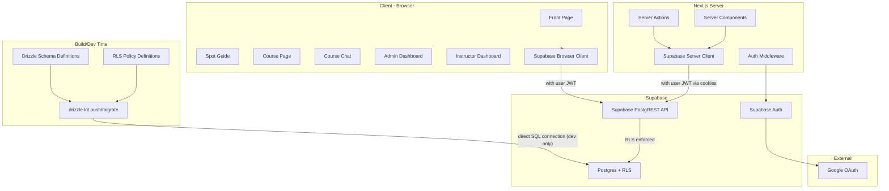
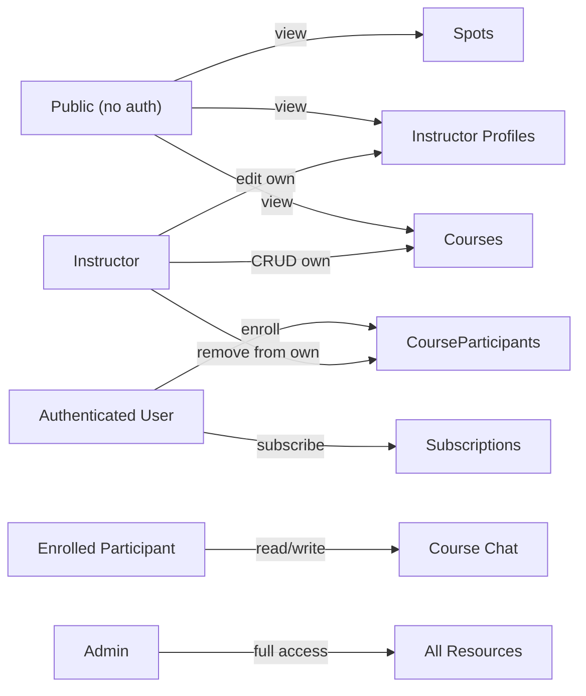
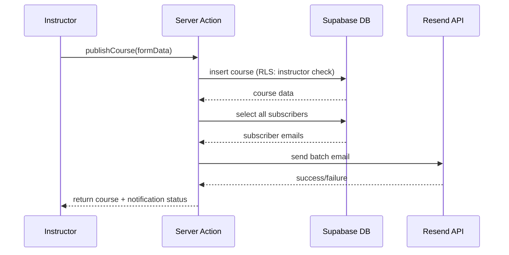

# Ålesund Kiteklubb -- Full Stack Implementation Plan

## Tech Stack

- **Framework:** Next.js 15 (App Router, TypeScript)
- **Database:** Supabase Postgres
- **Schema & Migrations:** Drizzle ORM + drizzle-kit (schema definition with native `pgPolicy` for RLS, migrations ONLY -- not used for runtime queries)
- **Runtime Data Access:** Supabase JS SDK (`@supabase/supabase-js` + `@supabase/ssr`) for ALL reads and writes
- **Auth:** Supabase Auth (Google OAuth provider)
- **Styling:** Tailwind CSS v4 + shadcn/ui
- **Deployment:** Vercel

### Key Architectural Principle

**Drizzle vs Supabase SDK -- separation of concerns:**

- **Drizzle** is a build/dev-time tool. It defines table schemas AND RLS policies in TypeScript using native `pgPolicy`, `authenticatedRole`, `authUid` from `drizzle-orm/supabase`. `drizzle-kit generate` produces the SQL migrations including `CREATE POLICY` statements. It connects to Postgres directly via `DATABASE_URL` only during `drizzle-kit push`/`drizzle-kit migrate`.
- **Supabase SDK** is the runtime data access layer. All queries (select, insert, update, delete) from both server and client components go through the Supabase client. This ensures RLS policies are enforced automatically, since the Supabase client passes the user's JWT to Postgres.

---

## Architecture Overview




---

## 1. Project Scaffolding

Initialize Next.js 15 with TypeScript, Tailwind CSS, App Router, and `src/` directory:

```bash
npx create-next-app@latest . --typescript --tailwind --app --src-dir --use-pnpm
```

Install core dependencies:

```bash
# Runtime: Supabase SDK for all data access + Resend for email
pnpm add @supabase/supabase-js @supabase/ssr resend

# Dev-time only: Drizzle for schema definitions and migrations
pnpm add -D drizzle-orm drizzle-kit postgres

# UI
pnpm dlx shadcn@latest init
```

Note: `drizzle-orm` and `postgres` are dev dependencies. They are only used by `drizzle-kit` to generate and push migrations. The application runtime never imports Drizzle -- all data access goes through the Supabase SDK.

Key config files to create:

- `drizzle.config.ts` -- Drizzle Kit config pointing to `DATABASE_URL` (Supabase direct connection string)
- `src/lib/db/schema/` -- Drizzle schema files (used by drizzle-kit, not imported at runtime)
- `src/lib/supabase/client.ts` -- Browser Supabase client (createBrowserClient)
- `src/lib/supabase/server.ts` -- Server Supabase client (createServerClient with cookies). **Next.js 15 breaking change:** `cookies()` is now async -- `createClient()` must be an `async` function that `await`s `cookies()` before passing them to `createServerClient`.
- `src/lib/supabase/middleware.ts` -- Auth session refresh
- `.env.local.example` -- Template for required env vars

Environment variables needed:

- `DATABASE_URL` -- Supabase Postgres **direct** connection string, **port 5432** (used ONLY by drizzle-kit for migrations, never at runtime). Do NOT use the transaction pooler (port 6543) -- DDL operations require session-level locks that the pooler cannot provide.
- `NEXT_PUBLIC_SUPABASE_URL` -- Supabase project URL (used by Supabase SDK at runtime)
- `NEXT_PUBLIC_SUPABASE_ANON_KEY` -- Supabase anon key (used by Supabase SDK at runtime)
- `SUPABASE_SERVICE_ROLE_KEY` -- Service role key (server-only, bypasses RLS for admin operations like role changes)
- `RESEND_API_KEY` -- Resend API key (server-only, for sending subscriber notification emails)

---

## 2. Database Schema (Drizzle -- schema definition only)

All schemas in `src/lib/db/schema/`. One file per table, re-exported from `src/lib/db/schema/index.ts`. These files are consumed by `drizzle-kit` to generate migrations -- they are NOT imported by the application runtime.

### 2a. Users (`src/lib/db/schema/users.ts`)

Synced from Supabase Auth on first login via auth callback.


| Column    | Type          | Notes                         |
| --------- | ------------- | ----------------------------- |
| id        | uuid PK       | Matches `auth.users.id`       |
| email     | text NOT NULL |                               |
| name      | text          |                               |
| avatarUrl | text          |                               |
| role      | enum          | `user`, `instructor`, `admin` |
| createdAt | timestamp     | default now()                 |


### 2b. Instructors (`src/lib/db/schema/instructors.ts`)


| Column          | Type      | Notes                   |
| --------------- | --------- | ----------------------- |
| id              | uuid PK   | default gen_random_uuid |
| userId          | uuid FK   | -> users.id, unique     |
| bio             | text      |                         |
| certifications  | text      | e.g. "IKO Level 2"      |
| yearsExperience | integer   |                         |
| phone           | text      |                         |
| photoUrl        | text      |                         |
| createdAt       | timestamp |                         |


### 2c. Courses (`src/lib/db/schema/courses.ts`)


| Column          | Type          | Notes                                 |
| --------------- | ------------- | ------------------------------------- |
| id              | uuid PK       |                                       |
| title           | text NOT NULL |                                       |
| description     | text          |                                       |
| price           | integer       | In NOK ( 500 kr)                      |
| date            | timestamp     |                                       |
| maxParticipants | integer       | nullable = unlimited                  |
| instructorId    | uuid FK       | -> instructors.id                     |
| spotId          | uuid FK       | -> spots.id, nullable                 |
| status          | enum          | `scheduled`, `completed`, `cancelled` |
| createdAt       | timestamp     |                                       |


### 2d. Course Participants (`src/lib/db/schema/courseParticipants.ts`)


| Column     | Type      | Notes         |
| ---------- | --------- | ------------- |
| id         | uuid PK   |               |
| userId     | uuid FK   | -> users.id   |
| courseId   | uuid FK   | -> courses.id |
| enrolledAt | timestamp | default now() |


Unique constraint on (userId, courseId).

Enrollment is handled via a Postgres RPC function (not a direct insert) to prevent overbooking -- see migration `0004`.

### 2e. Messages (`src/lib/db/schema/messages.ts`)


| Column    | Type          | Notes         |
| --------- | ------------- | ------------- |
| id        | uuid PK       |               |
| userId    | uuid FK       | -> users.id   |
| courseId  | uuid FK       | -> courses.id |
| content   | text NOT NULL |               |
| createdAt | timestamp     | default now() |


### 2f. Subscriptions (`src/lib/db/schema/subscriptions.ts`)


| Column    | Type          | Notes                |
| --------- | ------------- | -------------------- |
| id        | uuid PK       |                      |
| userId    | uuid FK       | -> users.id          |
| email     | text NOT NULL | Autofilled, editable |
| createdAt | timestamp     | default now()        |


### 2g. Spots (`src/lib/db/schema/spots.ts`)


| Column         | Type          | Notes                                                      |
| -------------- | ------------- | ---------------------------------------------------------- |
| id             | uuid PK       |                                                            |
| name           | text NOT NULL |                                                            |
| description    | text          | "Om spotten" text                                          |
| season         | enum          | `summer`, `winter` (SommerSpotter / VinterSpotter)         |
| area           | text NOT NULL | Grouping for dropdown level 2 (e.g. "Giske", "Ålesund")   |
| windDirections | text[]        | Array of compass strings: "N","NE","E","SE","S","SW","W","NW" |
| mapImageUrl    | text          | Admin-uploaded annotated map/satellite image of the spot   |
| latitude       | numeric       | For Yr link and Google Maps link                           |
| longitude      | numeric       | For Yr link and Google Maps link                           |
| skillLevel     | enum          | `beginner`, `experienced`                                  |
| skillNotes     | text          | e.g. "Du må kunne ta høyde, ikke veldig langgrunt"         |
| waterType      | text[]        | Array: "chop", "flat", "waves"                             |
| createdAt      | timestamp     |                                                            |

Yr and Google Maps links are generated dynamically from `latitude`/`longitude` (no stored URLs needed).


### RLS Policies (native Drizzle `pgPolicy` -- defined alongside tables)

RLS is the primary authorization mechanism. Policies are defined directly in the Drizzle schema files using `pgPolicy` from `drizzle-orm/pg-core` and Supabase helpers (`authenticatedRole`, `anonRole`, `authUid`) from `drizzle-orm/supabase`. `drizzle-kit generate` produces the `CREATE POLICY` SQL automatically.

Example pattern used across all tables:

```typescript
import { pgTable, uuid, text, pgPolicy } from 'drizzle-orm/pg-core';
import { authenticatedRole, anonRole, authUid } from 'drizzle-orm/supabase';
import { sql } from 'drizzle-orm';

export const courses = pgTable('courses', {
  id: uuid('id').primaryKey().defaultRandom(),
  title: text('title').notNull(),
  instructorId: uuid('instructor_id').references(() => instructors.id),
}, (table) => [
  pgPolicy("Public can view courses", {
    for: "select",
    to: anonRole,
    using: sql`true`,
  }),
  pgPolicy("Authenticated can view courses", {
    for: "select",
    to: authenticatedRole,
    using: sql`true`,
  }),
  pgPolicy("Instructors can insert own courses", {
    for: "insert",
    to: authenticatedRole,
    withCheck: sql`${table.instructorId} IN (
      SELECT id FROM instructors WHERE user_id = auth.uid()
    )`,
  }),
  pgPolicy("Instructors can update own courses", {
    for: "update",
    to: authenticatedRole,
    using: sql`${table.instructorId} IN (
      SELECT id FROM instructors WHERE user_id = auth.uid()
    )`,
  }),
]);
```

**Per-table policy summary:**

**Users table:**

- SELECT: Own row (`id = auth.uid()`). Admins can read all.
- INSERT: Via DB trigger (see below).
- UPDATE: Own row. Admins can update any.

**Instructors table:**

- SELECT: Public (everyone can see profiles).
- INSERT/DELETE: Admin only (checked via JWT claim, not DB query).
- UPDATE: Own profile (`user_id = auth.uid()`) or admin.

**Courses table:**

- SELECT: Public.
- INSERT: Authenticated users whose instructor record matches.
- UPDATE/DELETE: Course's own instructor or admin.

**Course Participants table:**

- SELECT: Own enrollments, course's instructor, or admin.
- INSERT: Authenticated user enrolling themselves (`user_id = auth.uid()`).
- DELETE: Own enrollment, course's instructor, or admin.

**Messages table:**

- SELECT/INSERT: Only participants of that course (subquery on `course_participants`).

**Subscriptions table:**

- SELECT/INSERT/DELETE: Own subscription only (`user_id = auth.uid()`).

**Spots table:**

- SELECT: Public.
- INSERT/UPDATE/DELETE: Admin only.

### Reading roles from JWT in RLS policies (no subqueries)

Since the Custom JWT Claims Hook (migration `0002`) injects `user_role` into the token, all RLS policies that check roles should read directly from the JWT instead of querying the `users` table. This is instant -- no table access needed.

```typescript
// Helper SQL fragment (reuse across all policies that check role)
const isAdmin = sql`(current_setting('request.jwt.claims', true)::jsonb)->>'user_role' = 'admin'`;
const isInstructor = sql`(current_setting('request.jwt.claims', true)::jsonb)->>'user_role' = 'instructor'`;
```

Admin bypass policy (added to every table where admins need full access):

```typescript
pgPolicy("Admin full access", {
  for: "all",
  to: authenticatedRole,
  using: isAdmin,
})
```

Same for instructor-scoped policies -- use `isInstructor` instead of a subquery to `users`.

### Supabase DB Trigger for User Sync

A Postgres trigger function on `auth.users` (after insert) automatically creates a row in `public.users` with `role = 'user'`. This is defined in a custom SQL migration alongside the Drizzle-generated migrations (Drizzle does not generate triggers, so this one SQL file is written manually).

### Custom JWT Claims (Auth Hook)

A Supabase Auth Hook ("Custom Access Token") injects the user's `role` from `public.users` directly into the JWT. This is a Postgres function that runs every time a token is issued/refreshed:

```sql
create or replace function public.custom_access_token_hook(event jsonb)
returns jsonb language plpgsql as $$
declare
  user_role text;
begin
  select role into user_role from public.users where id = (event->>'user_id')::uuid;
  if user_role is not null then
    event := jsonb_set(event, '{claims,user_role}', to_jsonb(user_role));
  else
    event := jsonb_set(event, '{claims,user_role}', '"user"');
  end if;
  return event;
end;
$$;
```

After this, `supabase.auth.getUser()` returns the role at `user.app_metadata.user_role` -- no DB query needed. This is enabled in the Supabase Dashboard under Authentication > Hooks.

**Trade-off:** When an admin changes a user's role, the JWT updates on next token refresh (~1 hour) or on re-login. For rare admin operations this is acceptable.

### Atomic Enrollment Function (RPC)

A Postgres function that atomically checks course capacity and enrolls the user, preventing race conditions where two users enroll at the same moment and exceed `maxParticipants`. Defined in migration `0004`.

```sql
create or replace function public.enroll_in_course(p_course_id uuid)
returns void language plpgsql security definer as $$
declare
  current_count int;
  max_count int;
begin
  -- Lock the course row to prevent concurrent enrollments
  select max_participants into max_count
    from courses where id = p_course_id for update;

  if max_count is not null then
    select count(*) into current_count
      from course_participants where course_id = p_course_id;

    if current_count >= max_count then
      raise exception 'Course is full';
    end if;
  end if;

  insert into course_participants (user_id, course_id)
    values (auth.uid(), p_course_id);
end;
$$;
```

Called via `supabase.rpc('enroll_in_course', { p_course_id: courseId })` instead of a direct insert. The `FOR UPDATE` lock on the course row serializes concurrent enrollments, making overbooking impossible.

---

## 3. Authentication

### 3a. Supabase Auth Setup

In the Supabase dashboard (manual step):

- Enable Google OAuth provider
- Set redirect URL to `{SITE_URL}/auth/callback`

### 3b. Auth Callback Route (`src/app/auth/callback/route.ts`)

- Exchanges the OAuth code for a session via `supabase.auth.exchangeCodeForSession(code)`
- User row creation in `public.users` is handled automatically by the Postgres trigger (see section 2)
- Redirects to `/`

### 3c. Middleware (`src/middleware.ts`)

- Refreshes Supabase auth session on every request
- Reads user role directly from the JWT claims (`user.app_metadata.user_role`) -- **no DB query needed**
- Protects `/admin/*` routes (requires `admin` role)
- Protects `/instructor/*` routes (requires `instructor` or `admin` role)
- Protects `/courses/*/chat` routes (requires authentication)

### 3d. Auth Helpers

- `src/lib/auth/index.ts` -- `getCurrentUser()` helper that calls `supabase.auth.getUser()` and reads the role from JWT claims (`user.app_metadata.user_role`). No database query needed. Used for UI-level decisions (showing admin nav, edit buttons, etc.), but NOT for security -- RLS handles that.

---

## 4. Authorization Model

Authorization is enforced at the **database level via RLS policies** (see section 2). The Supabase SDK automatically passes the user's JWT to Postgres, which applies RLS. This means:

- Application code does NOT need to check permissions before queries -- RLS will reject unauthorized operations automatically.
- Application code DOES use the user's role for **UI-level decisions** (e.g., showing the admin dashboard link, showing edit buttons).
- The middleware protects routes at the **page level** (redirecting unauthenticated users away from `/admin`, `/instructor`), but the actual data security is RLS.




All these permissions are enforced by Postgres RLS, not application code.

---

## 5. Pages and Routes

### 5a. Front Page (`src/app/page.tsx`) -- Static feel

Single-page scroll layout with sections:

- **Hero:** Panorama image of Giske beach with kites, overlaid club name
- **Om klubben:** About text with links to Facebook and group chat
- **Nav bar:** Fixed top nav, full-width, centered items. Scrolls to sections or navigates to `/courses`. Includes Spot Guide mega-dropdown (see 5b).

Design: Off-white content card floating over the panorama background. Shades of blue accents. Black text.

### 5b. Spot Guide (navbar dropdown, no listing page)

Spots are accessed exclusively through a multi-level dropdown in the navbar -- there is no `/spots` listing page.

**Dropdown structure:**

```
Spot Guide (nav item)
├── SommerSpotter (hover/click)
│   ├── Giske (area, hover/click)
│   │   ├── Alnes → /spots/[id]
│   │   └── Gjøsund → /spots/[id]
│   └── Ålesund (area)
│       └── Tueneset → /spots/[id]
└── VinterSpotter (hover/click)
    ├── Vigra (area)
    │   └── Blindheim → /spots/[id]
    └── ...
```

- **Level 1:** "SommerSpotter" and "VinterSpotter" (mapped from `spots.season`)
- **Level 2:** Areas within each season (mapped from `spots.area`, grouped)
- **Level 3:** Spot names (clicking navigates to `/spots/[id]`)

The dropdown data is fetched server-side in the layout and passed to the navbar component.

### 5b-ii. Spot Detail Page (`src/app/spots/[id]/page.tsx`)

A dedicated page for each spot with these sections:

- **Wind compass** -- visual compass rose highlighting the favorable `windDirections` (e.g. "SW", "NE")
- **Om spotten** -- `description` text
- **Kart** -- the admin-uploaded `mapImageUrl` (annotated satellite/map image showing the spot area)
- **Værmelding** -- link to Yr.no using `latitude`/`longitude` (opens in new tab): `https://www.yr.no/nb/v%C3%A6rvarsel/daglig-tabell/{lat},{lon}`
- **Veibeskrivelse** -- "Vis i Google Maps" button using `latitude`/`longitude` (opens in new tab): `https://www.google.com/maps?q={lat},{lon}`
- **Nødvendige kiteskills** -- `skillLevel` displayed as "Erfaren" or "Nybegynner" badge, plus `skillNotes` text
- **Type** -- `waterType` tags displayed as badges: "Chop", "Flatt vann", "Bølger"

All content is CMS-managed by admins.

### 5c. Courses (`src/app/courses/page.tsx`) -- Single-page scroll

Sections:

- **Intro kurs** -- what courses are about, who the instructors are, general info text
- **Scheduled Courses** -- list of course cards from DB. Each card shows course info (title, date, spot name linked to `/spots/[spotId]`, instructor, price). The card has stateful buttons depending on the user's enrollment:
  - **Not logged in:** "Logg inn for å melde på" (links to login)
  - **Logged in, not enrolled:** "Meld på" button (calls `enroll_in_course` RPC)
  - **Logged in, enrolled:** "Meld av" button (deletes from `course_participants`, RLS allows own deletion) + "Chat" button (links to `/courses/[id]/chat`)
  - On successful enrollment, a confirmation email is sent to the user (see section 7)
  - When no courses: semi-grayed placeholder text explaining that courses are posted when conditions look promising and not far in advance, prompting the user to subscribe to get notified. Includes a Subscribe button/link that scrolls to the Subscribe section.
- **Subscribe** -- requires login, autofills email, stores in subscriptions table. Notifies user by email when new courses are published.

### 5d. Course Chat (`src/app/courses/[id]/chat/page.tsx`)

- Only visible to enrolled participants (middleware-protected)
- Appears in nav as "Chat kurs dd/mm" for enrolled users
- Append-only message log, newest at bottom
- Auto-scroll, live updates via **Supabase Realtime** -- client subscribes to `postgres_changes` on the `messages` table filtered by `course_id`. New messages appear instantly without polling.
- Initial messages loaded server-side; participant user profiles cached client-side to enrich Realtime payloads (which don't include joined data)
- Messages show user avatar, name, timestamp

### 5e. Admin Dashboard (`src/app/admin/page.tsx` + sub-routes)

Protected by middleware (admin role only). Tabs/sections:

- **Instructors:** List all, add new (select existing user -> promote to instructor role + create instructor profile), edit, remove
- **Courses:** List all courses, create new (with searchable spot dropdown to link a spot), edit, cancel, view participants, remove participants
- **Spots:** Full CMS for spots -- create, edit, delete. Form fields: name, description, season (summer/winter), area, wind directions (multi-select compass), map image upload, latitude/longitude, skill level, skill notes, water type (multi-select). DataTable with filters by season and area.
- **Subscriptions:** View subscribers list
- **Users:** View all users, change roles

Uses shadcn/ui `DataTable`, `Dialog`, `Form`, `Tabs` components.

### 5f. Instructor Dashboard (`src/app/instructor/page.tsx`)

Protected by middleware (instructor or admin role):

- **Profile:** Edit own bio, certifications, experience, photo, phone
- **My Courses:** List own courses, create new (with searchable spot dropdown), edit, view/remove participants

### 5g. Auth Pages

- `src/app/login/page.tsx` -- Login page with "Sign in with Google" button
- `src/app/auth/callback/route.ts` -- OAuth callback handler

---

## 6. Server Actions and Data Access (all via Supabase SDK)

All data access uses the Supabase SDK. Server Actions use the server-side Supabase client (which reads the user's session from cookies). Client components can also query directly via the browser Supabase client. RLS ensures security regardless of where the query originates.

### Server Actions (`src/lib/actions/`)

Server Actions (`"use server"`) for mutations. Each creates a Supabase server client and calls SDK methods:

- `src/lib/actions/courses.ts` -- `supabase.from('courses').insert(...)`, `.update(...)`, `.delete(...)`; enrollment via `supabase.rpc('enroll_in_course', { p_course_id })` (atomic capacity check, no overbooking); unenrollment via `supabase.from('course_participants').delete().match({ user_id, course_id })` (RLS allows own deletion). On successful enrollment, sends a confirmation email to the user (see section 7). The `publishCourse` action inserts the course AND sends notification emails to all subscribers in one server-side request.
- `src/lib/actions/instructors.ts` -- CRUD on `instructors` table + updating user role to `instructor`
- `src/lib/actions/messages.ts` -- `supabase.from('messages').insert(...)`
- `src/lib/actions/subscriptions.ts` -- insert/delete on `subscriptions`
- `src/lib/actions/spots.ts` -- CRUD on `spots` + image upload to Supabase Storage (map image for each spot)
- `src/lib/actions/users.ts` -- admin-only role updates (admin uses service role client for this specific operation)

No application-level authorization checks needed -- RLS handles it. If a non-admin tries to insert an instructor, Postgres returns an error.

### Data Queries (`src/lib/queries/`)

Query functions used by Server Components and Server Actions. Each returns typed data from Supabase SDK:

- `src/lib/queries/courses.ts` -- `supabase.from('courses').select('*, instructors(*), spots(*)')`, with filters for status, date, etc.
- `src/lib/queries/instructors.ts` -- `supabase.from('instructors').select('*, users(*)')`
- `src/lib/queries/messages.ts` -- `supabase.from('messages').select('*, users(name, avatar_url)').eq('course_id', id).order('created_at')`
- `src/lib/queries/subscriptions.ts` -- check if current user has a subscription row
- `src/lib/queries/spots.ts` -- `supabase.from('spots').select('*')`; also a `getSpotsGrouped()` that fetches all spots and groups them by `season` then `area` for the navbar dropdown
- `src/lib/queries/users.ts` -- admin queries with service role client for user management

### Client-side Queries and Realtime

The browser Supabase client is used for the course chat Realtime subscription:

```typescript
const channel = supabase
  .channel(`chat-${courseId}`)
  .on('postgres_changes', {
    event: 'INSERT',
    schema: 'public',
    table: 'messages',
    filter: `course_id=eq.${courseId}`,
  }, (payload) => {
    // Enrich with cached participant profile, append to messages
  })
  .subscribe();
```

RLS applies to Realtime events -- users only receive inserts for courses they're enrolled in. The channel is cleaned up on unmount via `supabase.removeChannel(channel)`.

**Requires a custom migration** to add `messages` to the Realtime publication (see migration `0003`).

### Service Role Client (`src/lib/supabase/admin.ts`)

A server-only Supabase client using `SUPABASE_SERVICE_ROLE_KEY` that bypasses RLS. Used ONLY for:

- Admin operations that need to update other users' roles
- The DB trigger approach handles user creation, but fallback upsert uses this

This key is NEVER exposed to the client. Environment variable: `SUPABASE_SERVICE_ROLE_KEY` (server-only, not `NEXT_PUBLIC_`).

---

## 7. Email Notifications (Resend)

When an instructor publishes a new course, all subscribers receive an email notification. This is handled in a single Server Action to avoid gaps where the course is published but the email fails silently.

### Flow



### Implementation (`src/lib/actions/courses.ts`)

The `publishCourse` Server Action:
1. Inserts the course (with `spotId`) via Supabase server client (RLS verifies the user is an instructor)
2. On success, fetches the linked spot data and all subscriber emails from `subscriptions` table
3. Sends a batch email via Resend with course details (title, date, description, spot name + link to `/spots/[spotId]`, and a "Meld deg på" enroll link)
4. Returns the course data + whether the notification was sent successfully

If the email send fails, the course is still created -- the action returns a warning about the notification failure rather than rolling back.

### Enrollment Confirmation Email

When a user successfully enrolls in a course, a confirmation email is sent to them. The `enrollInCourse` Server Action:
1. Calls `supabase.rpc('enroll_in_course', { p_course_id })` (atomic enrollment)
2. On success, fetches course + spot details
3. Sends a confirmation email to the user with: course title, date, instructor, spot name + link, price, and a note that they can unenroll at `/courses`

### Email Setup

- **`src/lib/email/resend.ts`** -- Resend client initialized with `RESEND_API_KEY`
- **`src/lib/email/templates/new-course.tsx`** -- Subscriber notification: new course available. Includes course title, date, instructor name, price, spot link, and "Meld deg på" link.
- **`src/lib/email/templates/enrollment-confirmation.tsx`** -- Sent to user on enrollment. Includes course details, spot link, and note about unenrolling at `/courses`.
- **Sending domain** -- must be verified in the Resend dashboard (or use `onboarding@resend.dev` for testing)

---

## 8. UI Components

All in `src/components/`, using shadcn/ui as the base:

- **Layout:** `Navbar`, `Footer`, `ContentCard` (off-white card over panorama BG)
- **Auth:** `LoginButton`, `UserMenu` (avatar dropdown with role badge)
- **Courses:** `CourseCard` (stateful: shows "Meld på" / "Meld av" + "Chat" based on enrollment), `CourseList`, `ParticipantList`
- **Chat:** `ChatWindow`, `MessageBubble`, `MessageInput`
- **Spots:** `SpotGuideDropdown` (multi-level nav dropdown), `WindCompass` (visual compass rose), `SpotDetailPage` sections
- **Admin:** `InstructorForm`, `CourseForm` (with searchable spot dropdown via shadcn `Combobox`), `SpotForm` (with map image upload, compass direction picker, multi-select water type), `DataTable`
- **Subscription:** `SubscribeDialog`

---

## 9. Design System

- **Background:** Full-viewport panorama of Giske beach, fixed position
- **Content:** Off-white (`#FAFAF8`) content window scrolling over the background
- **Colors:** Shades of blue (`sky-600`/`sky-800` for accents), black text
- **Nav:** Full-width bar, items centered matching content width, sticky top
- **Typography:** Clean sans-serif (Inter via next/font)
- **Responsive:** Mobile-first, content card is full-width on mobile with padding

---

## 10. Deployment

- **Vercel:** Connect GitHub repo, auto-deploy on push
- **Supabase:** Separate hosted Supabase project (free tier to start)
- **Migrations:** Run `drizzle-kit push` or `drizzle-kit migrate` as part of CI/CD or manually
- **Environment:** Set env vars in Vercel dashboard

---

## File Structure Overview

```
src/
├── app/
│   ├── page.tsx                    # Front page
│   ├── layout.tsx                  # Root layout (nav, bg, fonts)
│   ├── login/page.tsx              # Login page
│   ├── auth/callback/route.ts      # OAuth callback
│   ├── spots/[id]/page.tsx          # Individual spot detail page (no listing page)
│   ├── courses/
│   │   ├── page.tsx                # Courses single-page
│   │   └── [id]/chat/page.tsx      # Per-course chat
│   ├── admin/
│   │   ├── page.tsx                # Admin dashboard
│   │   ├── instructors/page.tsx    # Manage instructors
│   │   ├── courses/page.tsx        # Manage courses
│   │   ├── spots/page.tsx          # Manage spots
│   │   └── users/page.tsx          # Manage users
│   └── instructor/
│       ├── page.tsx                # Instructor dashboard
│       └── courses/page.tsx        # Instructor's courses
├── components/
│   ├── ui/                         # shadcn/ui primitives
│   ├── layout/                     # Navbar, Footer, ContentCard
│   ├── auth/                       # LoginButton, UserMenu
│   ├── courses/                    # CourseCard, EnrollButton, etc.
│   ├── chat/                       # ChatWindow, MessageBubble
│   ├── spots/                      # SpotGuideDropdown, WindCompass, SpotDetail
│   └── admin/                      # Forms, DataTables
├── lib/
│   ├── db/
│   │   └── schema/                 # Drizzle schemas (dev-time only, consumed by drizzle-kit)
│   │       ├── index.ts            # Re-exports all schemas
│   │       ├── users.ts
│   │       ├── instructors.ts
│   │       ├── courses.ts
│   │       ├── courseParticipants.ts
│   │       ├── messages.ts
│   │       ├── subscriptions.ts
│   │       └── spots.ts
│   ├── supabase/
│   │   ├── client.ts               # Browser Supabase client (createBrowserClient)
│   │   ├── server.ts               # Server Supabase client (createServerClient + cookies)
│   │   ├── admin.ts                # Service role client (bypasses RLS, server-only)
│   │   └── middleware.ts           # Session refresh helper
│   ├── auth/index.ts               # getCurrentUser() helper via Supabase SDK
│   ├── actions/                    # Server actions (mutations via Supabase SDK)
│   ├── queries/                    # Query functions (reads via Supabase SDK)
│   └── email/
│       ├── resend.ts               # Resend client instance
│       └── templates/
│           ├── new-course.tsx      # Subscriber notification: new course available
│           └── enrollment-confirmation.tsx  # Sent to user on enrollment
├── types/
│   └── database.ts                 # Generated types from Supabase (npx supabase gen types)
└── middleware.ts                    # Next.js middleware (session refresh + route protection)

# Root-level (outside src/)
drizzle.config.ts                    # Drizzle Kit config (points to DATABASE_URL)
supabase/
└── migrations/                      # Generated by drizzle-kit (includes CREATE POLICY from pgPolicy)
    ├── 0000_initial_schema.sql      # Tables + RLS policies (auto-generated by drizzle-kit)
    ├── 0001_user_sync_trigger.sql   # Manual: trigger on auth.users to auto-create public.users
    ├── 0002_custom_jwt_hook.sql     # Manual: auth hook function to inject role into JWT claims
    ├── 0003_realtime_messages.sql   # Manual: ALTER PUBLICATION supabase_realtime ADD TABLE messages;
    └── 0004_enroll_function.sql    # Manual: atomic enroll_in_course() RPC function
```

### Type Generation and Dev Scripts

Supabase-generated TypeScript types are used with the Supabase SDK for type-safe queries at runtime. To keep types in sync with schema changes, add these scripts to `package.json`:

```json
"scripts": {
  "db:push": "drizzle-kit push",
  "db:generate": "drizzle-kit generate",
  "db:types": "supabase gen types typescript --project-id <ref> > src/types/database.ts",
  "db:sync": "pnpm db:push && pnpm db:types"
}
```

**Workflow:** After changing any Drizzle schema file, run `pnpm db:sync` to push the schema to Supabase and regenerate the runtime types in one step. This prevents stale types from causing silent bugs in Supabase SDK queries.