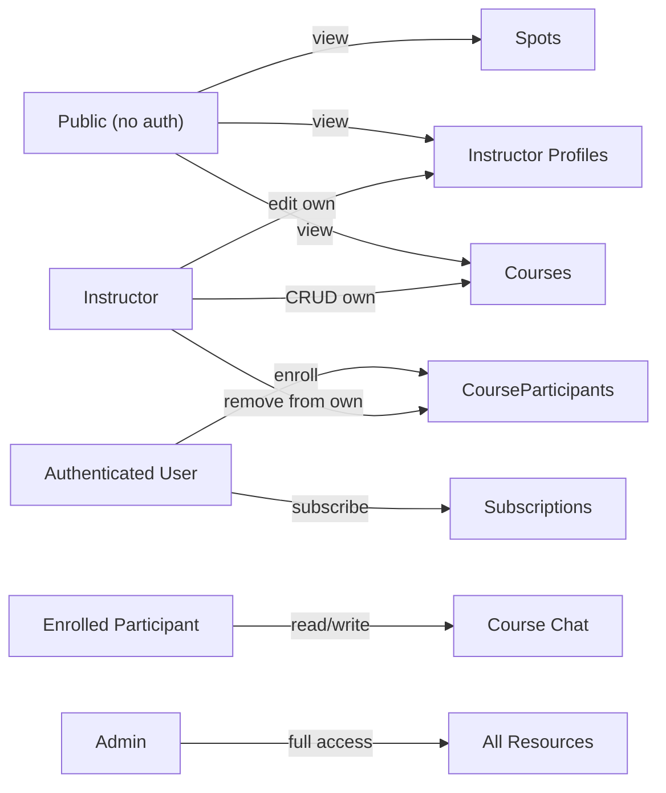

# Ålesund Kiteklubb -- Full Stack Implementation Plan

## Tech Stack

- **Framework:** Next.js 15 (App Router, TypeScript)
- **Database:** Supabase Postgres
- **Schema & Migrations:** Drizzle ORM + drizzle-kit (schema definition with native `pgPolicy` for RLS, migrations ONLY -- not used for runtime queries)
- **Runtime Data Access:** Supabase JS SDK (`@supabase/supabase-js` + `@supabase/ssr`) for ALL reads and writes
- **Auth:** Supabase Auth (Google OAuth provider)
- **Styling:** Tailwind CSS v4 + shadcn/ui
- **Deployment:** Vercel

### Key Architectural Principle

**Drizzle vs Supabase SDK -- separation of concerns:**

- **Drizzle** is a build/dev-time tool. It defines table schemas AND RLS policies in TypeScript using native `pgPolicy`, `authenticatedRole`, `authUid` from `drizzle-orm/supabase`. `drizzle-kit generate` produces the SQL migrations including `CREATE POLICY` statements. It connects to Postgres directly via `DATABASE_URL` only during `drizzle-kit push`/`drizzle-kit migrate`.
- **Supabase SDK** is the runtime data access layer. All queries (select, insert, update, delete) from both server and client components go through the Supabase client. This ensures RLS policies are enforced automatically, since the Supabase client passes the user's JWT to Postgres.

---

## Architecture Overview


---

## 1. Project Scaffolding

Initialize Next.js 15 with TypeScript, Tailwind CSS, App Router, and `src/` directory:

```bash
npx create-next-app@latest . --typescript --tailwind --app --src-dir --use-pnpm
```

Install core dependencies:

```bash
# Runtime: Supabase SDK for all data access + Resend for email
pnpm add @supabase/supabase-js @supabase/ssr resend

# Drizzle for schema definitions and migrations
# drizzle-orm is a regular dep so schema files under src/ pass type-checking during next build
pnpm add drizzle-orm
pnpm add -D drizzle-kit postgres

# UI
pnpm dlx shadcn@latest init
```

Note: `drizzle-orm` is a regular dependency because schema files under `src/` must pass TypeScript type-checking during `next build` (even though no runtime code imports them). It adds zero client bundle weight. `drizzle-kit` and `postgres` remain dev dependencies -- they are only used to generate and push migrations.

Key config files to create:

- `drizzle.config.ts` -- Drizzle Kit config. `schema`: `./src/lib/db/schema`. `out`: `./drizzle` (Drizzle's migration output; we use `push` for schema, so this is for `generate` only). `dbCredentials.url`: `DATABASE_URL`.
- `src/lib/db/schema/` -- Drizzle schema files (used by drizzle-kit, not imported at runtime)
- `src/lib/supabase/client.ts` -- Browser Supabase client (createBrowserClient)
- `src/lib/supabase/server.ts` -- Server Supabase client (createServerClient with cookies). **Next.js 15 breaking change:** `cookies()` is now async -- `createClient()` must be an `async` function that `await`s `cookies()` before passing them to `createServerClient`.
- `src/lib/supabase/middleware.ts` -- Auth session refresh
- `.env.local.example` -- Template for required env vars

Environment variables needed:

- `DATABASE_URL` -- Supabase Postgres **direct** connection string, **port 5432** (used ONLY by drizzle-kit for migrations, never at runtime). Do NOT use the transaction pooler (port 6543) -- DDL operations require session-level locks that the pooler cannot provide.
- `NEXT_PUBLIC_SUPABASE_URL` -- Supabase project URL (used by Supabase SDK at runtime)
- `NEXT_PUBLIC_SUPABASE_ANON_KEY` -- Supabase anon key (used by Supabase SDK at runtime)
- `SUPABASE_SERVICE_ROLE_KEY` -- Service role key (server-only, bypasses RLS for admin operations like role changes)
- `RESEND_API_KEY` -- Resend API key (server-only, for sending subscriber notification emails)
- `NEXT_PUBLIC_SITE_URL` -- Full origin of the app (e.g. `https://aalesundkiteklubb.no` in production, `http://localhost:3000` in dev). Used for OAuth redirect URLs in Supabase dashboard: add `{NEXT_PUBLIC_SITE_URL}/auth/callback` as an authorized redirect for Google OAuth.

---

## 2. Database Schema (Drizzle -- schema definition only)

All schemas in `src/lib/db/schema/`. One file per table, re-exported from `src/lib/db/schema/index.ts`. These files are consumed by `drizzle-kit` to generate migrations -- they are NOT imported by the application runtime.

### 2a. Users (`src/lib/db/schema/users.ts`)

Synced from Supabase Auth on first login via auth callback.


| Column    | Type          | Notes                         |
| --------- | ------------- | ----------------------------- |
| id        | uuid PK       | Matches `auth.users.id`       |
| email     | text NOT NULL |                               |
| name      | text          |                               |
| avatarUrl | text          |                               |
| role      | enum          | `user`, `instructor`, `admin` |
| createdAt | timestamp     | default now()                 |


### 2b. Instructors (`src/lib/db/schema/instructors.ts`)


| Column          | Type      | Notes                   |
| --------------- | --------- | ----------------------- |
| id              | uuid PK   | default gen_random_uuid |
| userId          | uuid FK   | -> users.id, unique, ON DELETE CASCADE |
| bio             | text      |                         |
| certifications  | text      | e.g. "IKO Level 2"      |
| yearsExperience | integer   |                         |
| phone           | text      |                         |
| photoUrl        | text      | Supabase Storage public URL from `instructor-photos` bucket |
| createdAt       | timestamp |                         |

**Sync invariant:** Users with `role = 'instructor'` or `role = 'admin'` always have a row in `instructors`. Admins automatically get an instructor profile when promoted (so they can create courses using the same UI). These are created atomically via admin actions (see section 6). The JWT claim (`user_role`) handles fast permission checks (middleware, UI). The `instructors` table holds profile data and provides the FK for `courses.instructorId`.


### 2c. Courses (`src/lib/db/schema/courses.ts`)


| Column          | Type          | Notes                                 |
| --------------- | ------------- | ------------------------------------- |
| id              | uuid PK       |                                       |
| title           | text NOT NULL |                                       |
| description     | text          |                                       |
| price           | integer       | In NOK ( 500 kr)                      |
| date            | timestamp     |                                       |
| maxParticipants | integer       | nullable = unlimited                  |
| instructorId    | uuid FK       | -> instructors.id, nullable, ON DELETE SET NULL |
| spotId          | uuid FK       | -> spots.id, nullable, ON DELETE SET NULL |
| createdAt       | timestamp     |                                       |


### 2d. Course Participants (`src/lib/db/schema/courseParticipants.ts`)


| Column     | Type      | Notes         |
| ---------- | --------- | ------------- |
| id         | uuid PK   |               |
| userId     | uuid FK   | -> users.id, ON DELETE CASCADE   |
| courseId   | uuid FK   | -> courses.id, ON DELETE CASCADE |
| enrolledAt | timestamp | default now() |


Unique constraint on (userId, courseId).

Enrollment is handled via a Postgres RPC function (not a direct insert) to prevent overbooking -- see migration `0004`.

### 2e. Messages (`src/lib/db/schema/messages.ts`)


| Column    | Type          | Notes         |
| --------- | ------------- | ------------- |
| id        | uuid PK       |               |
| userId    | uuid FK       | -> users.id, nullable, ON DELETE SET NULL (shows "Slettet bruker" in chat) |
| courseId  | uuid FK       | -> courses.id, ON DELETE CASCADE |
| content   | text NOT NULL |               |
| createdAt | timestamp     | default now() |


### 2f. Subscriptions (`src/lib/db/schema/subscriptions.ts`)


| Column    | Type          | Notes                |
| --------- | ------------- | -------------------- |
| id        | uuid PK       |                      |
| userId    | uuid FK       | -> users.id, **unique**, ON DELETE CASCADE |
| email     | text NOT NULL | Autofilled, editable |
| createdAt | timestamp     | default now()        |


### 2g. Spots (`src/lib/db/schema/spots.ts`)


| Column         | Type          | Notes                                                      |
| -------------- | ------------- | ---------------------------------------------------------- |
| id             | uuid PK       |                                                            |
| name           | text NOT NULL |                                                            |
| description    | text          | "Om spotten" text                                          |
| season         | enum          | `summer`, `winter` (SommerSpotter / VinterSpotter)         |
| area           | text NOT NULL | Grouping for filtering (e.g. "Giske", "Ålesund"). Free text. Admin form uses a Combobox that suggests existing area values from other spots (typed text filters the list). Selecting autofills the field; typing a new value uses it as-is. Used for area filter on listing page. |
| windDirections | text[]        | Array of compass strings: "N","NE","E","SE","S","SW","W","NW" |
| mapImageUrl    | text          | Supabase Storage public URL from `spot-maps` bucket         |
| latitude       | numeric       | For Yr link and Google Maps link                           |
| longitude      | numeric       | For Yr link and Google Maps link                           |
| skillLevel     | enum          | `beginner`, `experienced`                                  |
| skillNotes     | text          | e.g. "Du må kunne ta høyde, ikke veldig langgrunt"         |
| waterType      | text[]        | Array: "chop", "flat", "waves"                             |
| createdAt      | timestamp     |                                                            |

Yr and Google Maps links are generated dynamically from `latitude`/`longitude` (no stored URLs needed).


### 2h. Supabase Storage (buckets + RLS)

Image uploads use two public buckets. Buckets and `storage.objects` RLS policies are defined in migration `0005` (Drizzle does not manage the `storage` schema).

**Bucket: `spot-maps`**
- **Purpose:** Admin-uploaded annotated map/satellite images for spots
- **Path:** `{spotId}/{filename}` (e.g. `abc-123/map.jpg`)
- **RLS on storage.objects:**
  - SELECT: Public (allow all for `bucket_id = 'spot-maps'`)
  - INSERT/UPDATE/DELETE: Admin only (`(current_setting('request.jwt.claims', true)::jsonb)->>'user_role' = 'admin'`)

**Bucket: `instructor-photos`**
- **Purpose:** Instructor profile photos (instructors and admins upload their own)
- **Path:** `{userId}/{filename}` (e.g. `abc-123/photo.jpg`) — first path segment must match `auth.uid()`
- **RLS on storage.objects:**
  - SELECT: Public (allow all for `bucket_id = 'instructor-photos'`)
  - INSERT: Authenticated with role instructor or admin, and `(storage.foldername(name))[1] = auth.uid()::text`
  - UPDATE/DELETE: Same path constraint (own folder only)

**Migration `0005`** creates the buckets via `INSERT INTO storage.buckets` (id, name, public, file_size_limit, allowed_mime_types) and adds the `storage.objects` RLS policies above. Both buckets are public (served via CDN). Recommend 5MB limit for spot-maps, 2MB for instructor-photos; allow jpeg, png, webp.

**Upload flow:** Server Actions call `supabase.storage.from(bucket).upload(path, file)`, then `getPublicUrl(path)` to obtain the URL stored in `instructors.photoUrl` or `spots.mapImageUrl`.


### RLS Policies (native Drizzle `pgPolicy` -- defined alongside tables)

RLS is the primary authorization mechanism. Policies are defined directly in the Drizzle schema files using `pgPolicy` from `drizzle-orm/pg-core` and Supabase helpers (`authenticatedRole`, `anonRole`, `authUid`) from `drizzle-orm/supabase`. `drizzle-kit generate` produces the `CREATE POLICY` SQL automatically.

Example pattern used across all tables:

```typescript
import { pgTable, uuid, text, pgPolicy } from 'drizzle-orm/pg-core';
import { authenticatedRole, anonRole, authUid } from 'drizzle-orm/supabase';
import { sql } from 'drizzle-orm';

export const courses = pgTable('courses', {
  id: uuid('id').primaryKey().defaultRandom(),
  title: text('title').notNull(),
  instructorId: uuid('instructor_id').references(() => instructors.id),
}, (table) => [
  pgPolicy("Public can view courses", {
    for: "select",
    to: anonRole,
    using: sql`true`,
  }),
  pgPolicy("Authenticated can view courses", {
    for: "select",
    to: authenticatedRole,
    using: sql`true`,
  }),
  pgPolicy("Instructors can insert own courses", {
    for: "insert",
    to: authenticatedRole,
    withCheck: sql`${table.instructorId} IN (
      SELECT id FROM instructors WHERE user_id = auth.uid()
    )`,
  }),
  pgPolicy("Instructors can update own courses", {
    for: "update",
    to: authenticatedRole,
    using: sql`${table.instructorId} IN (
      SELECT id FROM instructors WHERE user_id = auth.uid()
    )`,
  }),
]);
```

**Per-table policy checklist:**

Every policy below MUST be implemented as a `pgPolicy` in the corresponding Drizzle schema file. Use the `isAdmin` / `isInstructor` JWT helpers (see below) for role checks — never subquery `users` for role. The "Admin full access" policy (for: `"all"`, using: `isAdmin`, withCheck: `isAdmin`) should be added to every table where admin access is listed.

**Users table** (`src/lib/db/schema/users.ts`) — 4 policies:

1. `"Users can read own profile"` — SELECT, `authenticatedRole`, using: `id = auth.uid()`
2. `"Co-participants can read profile fields"` — SELECT, `authenticatedRole`, using: EXISTS subquery on `course_participants` (see Chat-related RLS section below for SQL)
3. `"Admin full access"` — ALL, `authenticatedRole`, using/withCheck: `isAdmin`
4. No INSERT/UPDATE/DELETE policies for non-admins. INSERT happens via DB trigger. UPDATE/DELETE by admins uses service role (bypasses RLS).

**Instructors table** (`src/lib/db/schema/instructors.ts`) — 4 policies:

1. `"Public can view instructor profiles"` — SELECT, `anonRole`, using: `true`
2. `"Authenticated can view instructor profiles"` — SELECT, `authenticatedRole`, using: `true`
3. `"Instructors can update own profile"` — UPDATE, `authenticatedRole`, using: `user_id = auth.uid()`
4. `"Admin full access"` — ALL, `authenticatedRole`, using/withCheck: `isAdmin`

**Courses table** (`src/lib/db/schema/courses.ts`) — 6 policies:

1. `"Public can view courses"` — SELECT, `anonRole`, using: `true`
2. `"Authenticated can view courses"` — SELECT, `authenticatedRole`, using: `true`
3. `"Instructors can insert own courses"` — INSERT, `authenticatedRole`, withCheck: `instructorId IN (SELECT id FROM instructors WHERE user_id = auth.uid())`
4. `"Instructors can update own courses"` — UPDATE, `authenticatedRole`, using: same instructor subquery
5. `"Instructors can delete own courses"` — DELETE, `authenticatedRole`, using: same instructor subquery
6. `"Admin full access"` — ALL, `authenticatedRole`, using/withCheck: `isAdmin`

**Course Participants table** (`src/lib/db/schema/courseParticipants.ts`) — 6 policies:

1. `"Users can view own enrollments"` — SELECT, `authenticatedRole`, using: `user_id = auth.uid()`
2. `"Instructors can view their course participants"` — SELECT, `authenticatedRole`, using: `course_id IN (SELECT id FROM courses WHERE instructor_id IN (SELECT id FROM instructors WHERE user_id = auth.uid()))`
3. `"Participants can see co-participants in same course"` — SELECT, `authenticatedRole`, using: EXISTS subquery (see Chat-related RLS section below for SQL)
4. `"Users can enroll themselves"` — INSERT, `authenticatedRole`, withCheck: `user_id = auth.uid()` (note: enrollment primarily goes through `enroll_in_course` RPC which uses `security definer`, but this policy is still needed as a safety net)
5. `"Users can unenroll themselves"` — DELETE, `authenticatedRole`, using: `user_id = auth.uid()`
6. `"Admin full access"` — ALL, `authenticatedRole`, using/withCheck: `isAdmin`

**Messages table** (`src/lib/db/schema/messages.ts`) — 3 policies:

1. `"Course participants can read messages"` — SELECT, `authenticatedRole`, using: `course_id IN (SELECT course_id FROM course_participants WHERE user_id = auth.uid())`
2. `"Course participants can send messages"` — INSERT, `authenticatedRole`, withCheck: `user_id = auth.uid() AND course_id IN (SELECT course_id FROM course_participants WHERE user_id = auth.uid())`
3. `"Admin full access"` — ALL, `authenticatedRole`, using/withCheck: `isAdmin`

**Subscriptions table** (`src/lib/db/schema/subscriptions.ts`) — 4 policies:

1. `"Users can view own subscription"` — SELECT, `authenticatedRole`, using: `user_id = auth.uid()`
2. `"Users can create own subscription"` — INSERT, `authenticatedRole`, withCheck: `user_id = auth.uid()`
3. `"Users can delete own subscription"` — DELETE, `authenticatedRole`, using: `user_id = auth.uid()`
4. `"Admin full access"` — ALL, `authenticatedRole`, using/withCheck: `isAdmin`

**Spots table** (`src/lib/db/schema/spots.ts`) — 3 policies:

1. `"Public can view spots"` — SELECT, `anonRole`, using: `true`
2. `"Authenticated can view spots"` — SELECT, `authenticatedRole`, using: `true`
3. `"Admin full access"` — ALL, `authenticatedRole`, using/withCheck: `isAdmin`

**Total: 30 policies** across 7 tables. All must be defined as `pgPolicy` calls in the schema files so `drizzle-kit generate` produces the corresponding `CREATE POLICY` SQL.

### Reading roles from JWT in RLS policies (no subqueries)

Since the Custom JWT Claims Hook (migration `0002`) injects `user_role` into the token, all RLS policies that check roles should read directly from the JWT instead of querying the `users` table. This is instant -- no table access needed.

```typescript
// Helper SQL fragment (reuse across all policies that check role)
const isAdmin = sql`(current_setting('request.jwt.claims', true)::jsonb)->>'user_role' = 'admin'`;
const isInstructor = sql`(current_setting('request.jwt.claims', true)::jsonb)->>'user_role' = 'instructor'`;
```

Admin bypass policy (added to every table where admins need full access):

```typescript
pgPolicy("Admin full access", {
  for: "all",
  to: authenticatedRole,
  using: isAdmin,
  withCheck: isAdmin,
})
```

Same for instructor-scoped policies -- use `isInstructor` instead of a subquery to `users`.

### Chat-related RLS (users and course_participants)

Chat needs to display other participants' names and avatars. Add these policies:

**Users** — co-participant read (for chat profile enrichment):

```typescript
pgPolicy("Co-participants can read profile fields", {
  for: "select",
  to: authenticatedRole,
  using: sql` EXISTS (
    SELECT 1 FROM course_participants cp1
    WHERE cp1.user_id = auth.uid()
    AND EXISTS (
      SELECT 1 FROM course_participants cp2
      WHERE cp2.course_id = cp1.course_id AND cp2.user_id = ${table.id}
    )
  )`,
})
```

**Course participants** — participant list read (enables pre-fetch for chat):

```typescript
pgPolicy("Participants can see co-participants in same course", {
  for: "select",
  to: authenticatedRole,
  using: sql` EXISTS (
    SELECT 1 FROM course_participants my
    WHERE my.user_id = auth.uid() AND my.course_id = ${table.courseId}
  )`,
})
```

### Supabase DB Trigger for User Sync

A Postgres trigger function on `auth.users` (AFTER INSERT) automatically creates a row in `public.users` with `role = 'user'`. This is defined in migration `0001`.

**Timing:** The trigger runs synchronously in the same transaction as the `auth.users` insert. When Supabase commits the new user, both `auth.users` and `public.users` exist. The redirect to our callback happens after that commit, so when our callback runs, the trigger has already completed.

### Custom JWT Claims (Auth Hook)

A Supabase Auth Hook ("Custom Access Token") injects the user's `role` from `public.users` directly into the JWT. This is a Postgres function that runs every time a token is issued/refreshed:

```sql
create or replace function public.custom_access_token_hook(event jsonb)
returns jsonb language plpgsql as $$
declare
  user_role text;
begin
  select role into user_role from public.users where id = (event->>'user_id')::uuid;
  if user_role is not null then
    event := jsonb_set(event, '{claims,user_role}', to_jsonb(user_role));
  else
    event := jsonb_set(event, '{claims,user_role}', '"user"');
  end if;
  return event;
end;
$$;
```

After this, every access token issued by Supabase contains `user_role` as a top-level JWT claim. **Important:** this claim is NOT in `user.app_metadata` — it lives in the raw JWT payload. To read it on the JS side, decode the access token from the session:

```typescript
const { data: { session } } = await supabase.auth.getSession();
const jwt = JSON.parse(atob(session.access_token.split('.')[1]));
const role = jwt.user_role; // 'user' | 'instructor' | 'admin'
```

`supabase.auth.getUser()` returns the user object from the Auth API — it does **not** include custom JWT claims injected by hooks. Always use `getSession()` + token decode for role checks.

This is enabled in the Supabase Dashboard under Authentication > Hooks.

**Trade-off:** When an admin changes a user's role, the JWT updates on next token refresh (~1 hour) or on re-login. For rare admin operations this is acceptable.

### Atomic Enrollment Function (RPC)

A Postgres function that atomically checks course capacity and enrolls the user, preventing race conditions where two users enroll at the same moment and exceed `maxParticipants`. Defined in migration `0004`.

```sql
create or replace function public.enroll_in_course(p_course_id uuid)
returns void language plpgsql security definer as $$
declare
  current_count int;
  max_count int;
begin
  -- Lock the course row to prevent concurrent enrollments
  select max_participants into max_count
    from courses where id = p_course_id for update;

  if max_count is not null then
    select count(*) into current_count
      from course_participants where course_id = p_course_id;

    if current_count >= max_count then
      raise exception 'Course is full';
    end if;
  end if;

  insert into course_participants (user_id, course_id)
    values (auth.uid(), p_course_id);
end;
$$;
```

Called via `supabase.rpc('enroll_in_course', { p_course_id: courseId })` instead of a direct insert. The `FOR UPDATE` lock on the course row serializes concurrent enrollments, making overbooking impossible.

---

## 3. Authentication

### 3a. Supabase Auth Setup

Manual configuration in two places:

**Supabase Dashboard:**
- Enable Google OAuth provider
- Add redirect URL `{NEXT_PUBLIC_SITE_URL}/auth/callback` (e.g. `https://aalesundkiteklubb.no/auth/callback`) in the Google OAuth provider settings

**Google Cloud Console:**
- Add your Supabase project's callback URL to Authorized redirect URIs in the OAuth 2.0 Client (APIs & Services > Credentials). The exact URL (e.g. `https://<project-ref>.supabase.co/auth/v1/callback`) is shown on the Supabase Dashboard > Authentication > Providers > Google page.

### 3b. Auth Callback Route (`src/app/auth/callback/route.ts`)

1. Exchange the OAuth code for a session via `supabase.auth.exchangeCodeForSession(code)`.
2. **Upsert into `public.users`** using the service role client: `INSERT ... ON CONFLICT (id) DO UPDATE SET email=..., name=..., avatar_url=...`. Do NOT overwrite `role` on conflict (admin-managed).
3. Redirect to `/`.

**Why upsert in the callback?** The trigger creates the row first (same transaction as `auth.users`), so normally the row already exists when the callback runs. The callback upsert is a safety net: if the trigger failed, if the user was created outside our flow, or if there's any edge case, the callback ensures `public.users` has the row. It also refreshes `email`/`name`/`avatar_url` from the latest Google profile on every login. Idempotent — no race: upsert handles both "row missing" and "row exists" correctly.

### 3c. Middleware (`src/middleware.ts`)

**Location:** With `src/` enabled, Next.js middleware lives at `src/middleware.ts` (not at project root). The Supabase session-refresh helper lives at `src/lib/supabase/middleware.ts` and is imported by the main middleware.

- Refreshes Supabase auth session on every request
- Reads user role by decoding the access token from `supabase.auth.getSession()` (`jwt.user_role`) -- **no DB query needed** (the custom access token hook injects `user_role` as a top-level JWT claim, not in `app_metadata`)
- Protects `/admin/*` routes (requires `admin` role)
- Protects `/instructor/*` routes (requires `instructor` or `admin` role)
- Protects `/courses/*/chat` routes (requires authentication only — enrollment must be enforced at page level; see 5d)

### 3d. Auth Helpers

- `src/lib/auth/index.ts` -- `getCurrentUser()` helper that calls `supabase.auth.getSession()`, decodes the access token JWT, and reads `user_role` from the token payload. No database query needed. Also extracts user info (id, email, etc.) from the same token or from `session.user`. Used for UI-level decisions (showing admin nav, edit buttons, etc.), but NOT for security -- RLS handles that.

---

## 4. Authorization Model

Authorization is enforced at the **database level via RLS policies** (see section 2). The Supabase SDK automatically passes the user's JWT to Postgres, which applies RLS. This means:

- Application code does NOT need to check permissions before queries -- RLS will reject unauthorized operations automatically.
- Application code DOES use the user's role for **UI-level decisions** (e.g., showing the admin dashboard link, showing edit buttons).
- The middleware protects routes at the **page level** (redirecting unauthenticated users away from `/admin`, `/instructor`), but the actual data security is RLS.




All these permissions are enforced by Postgres RLS, not application code.

---

## 5. Pages and Routes

### 5a. Front Page (`src/app/page.tsx`) -- Static feel

Single-page scroll layout with sections:

- **Hero:** Panorama image of Giske beach with kites, overlaid club name
- **Om klubben:** About text with links to Facebook and group chat
- **Nav bar:** Fixed top nav, full-width, centered items. Scrolls to sections or navigates to `/courses` and `/spots`. **On mobile:** collapses into a hamburger menu that opens a full-screen overlay.

Design: Off-white content card floating over the panorama background. Shades of blue accents. Black text.

### 5b. Spots Listing Page (`src/app/spots/page.tsx`)

Spots are accessed via a direct nav link to `/spots`. One nav item "Spotter" links to the listing page.

**Layout:**
- **Filters:** Placed in a drawer at the top of the page (same on mobile and desktop). Season (SommerSpotter / VinterSpotter), Area (e.g. Giske, Ålesund), Wind direction (N, NE, E, SE, S, SW, W, NW — multi-select). Filters are applied client-side or via URL params for shareable links. Drawer can be collapsed/expanded.
- **Spot cards:** Grid of cards below the filter drawer, each showing spot name, area, season badge, skill level, wind compass (or favorable wind badges). Tap/click navigates to `/spots/[id]`.
- **Empty state:** If no spots match filters, show clear message and option to clear filters.

**Responsive:** Cards stack in a single column on mobile; grid on larger screens.

### 5b-ii. Spot Detail Page (`src/app/spots/[id]/page.tsx`)

A dedicated page for each spot with these sections:

- **Wind compass** -- visual compass rose highlighting the favorable `windDirections` (e.g. "SW", "NE")
- **Om spotten** -- `description` text
- **Kart** -- the admin-uploaded `mapImageUrl` (annotated satellite/map image showing the spot area)
- **Værmelding** -- link to Yr.no using `latitude`/`longitude` (opens in new tab): `https://www.yr.no/nb/v%C3%A6rvarsel/daglig-tabell/{lat},{lon}`
- **Veibeskrivelse** -- "Vis i Google Maps" button using `latitude`/`longitude` (opens in new tab): `https://www.google.com/maps?q={lat},{lon}`
- **Nødvendige kiteskills** -- `skillLevel` displayed as "Erfaren" or "Nybegynner" badge, plus `skillNotes` text
- **Type** -- `waterType` tags displayed as badges: "Chop", "Flatt vann", "Bølger"

All content is CMS-managed by admins.

### 5c. Courses (`src/app/courses/page.tsx`) -- Single-page scroll

Sections:

- **Intro kurs** -- what courses are about, who the instructors are, general info text
- **Scheduled Courses** -- list of course cards from DB. Each card shows course info (title, date, spot name linked to `/spots/[spotId]`, instructor, price). The card has stateful buttons depending on the user's enrollment:
  - **Not logged in:** "Logg inn for å melde på" (links to login)
  - **Logged in, not enrolled:** "Meld på" button opens a confirmation dialog (description of action, prefilled editable email, "Avbryt" + "Meld på" buttons). On confirm, calls `enroll_in_course` RPC. **Do not show "Chat"** — only enrolled users see it.
  - **Logged in, enrolled:** "Meld av" button opens a confirmation dialog (description of action, "Avbryt" + "Meld av" buttons). On confirm, deletes from `course_participants`. "Chat" button links to `/courses/[id]/chat`.
  - On successful enrollment, a confirmation email is sent to the user (see section 7)
  - When no courses: semi-grayed placeholder text explaining that courses are posted when conditions look promising and not far in advance, prompting the user to subscribe to get notified. Includes a Subscribe button/link that scrolls to the Subscribe section.
- **Subscribe** -- requires login. Clicking Subscribe opens a confirmation dialog with: description of the action (e.g. receive email when new courses are published), prefilled editable email field, "Avbryt" (cancel) and "Meld på" (confirm) buttons. On confirm, stores in subscriptions table. If already subscribed, "Meld av" opens a confirmation dialog (description, "Avbryt" + "Meld av"); on confirm, removes from subscriptions.

### 5d. Course Chat (`src/app/courses/[id]/chat/page.tsx`)

- **Enrollment-gated access.** Middleware only checks authentication for `/courses/*/chat` — a logged-in user who is not enrolled could otherwise reach the page. Add an explicit **page-level check** before rendering: verify the user is in `course_participants` for that course. If not, redirect to `/courses` or show: "Du må være meldt på kurset for å se chatten."
- **Not in nav.** Accessed only via the "Chat" button on the course card in `/courses` and links in the enrollment confirmation email — only visible on the card when the user is enrolled (see 5c). No navbar or mobile menu entry for chat.
- Append-only message log, newest at bottom
- Auto-scroll, live updates via **Supabase Realtime** -- client subscribes to `postgres_changes` on the `messages` table filtered by `course_id`. New messages appear instantly without polling.
- **Realtime profile enrichment:** Realtime payloads include raw message data only (no joined user data). Strategy: (1) Pre-fetch all course participants (from `course_participants` joined with `users`) at chat load to populate the profile cache. (2) When a Realtime INSERT arrives for an unknown `user_id`, fetch that user's profile on demand (`users(id, name, avatar_url)`), add to cache, and render. Show a short-lived placeholder (generic avatar or "...") while the fetch is in progress. RLS policies on `users` and `course_participants` must allow this (see section 2 RLS).
- Initial messages loaded server-side with joined user data; cache is seeded from that plus the pre-fetched participant list.
- Messages show user avatar, name, timestamp

### 5e. Admin Dashboard (`src/app/admin/page.tsx`) -- Single page, tabbed

Protected by middleware (admin role only). One page with shadcn/ui `Tabs` to switch between sections. No sub-routes -- everything lives on `/admin`.

**Tab: Instruktører**
- DataTable listing all instructors (name, email, certifications, created date)
- "Legg til instruktør" button → Dialog with a user search/select field. On submit, atomically creates `instructors` profile row and sets `users.role = 'instructor'`.
- Row actions: Edit (opens Dialog with profile form), Remove (atomically deletes profile and resets role to `user`)

**Tab: Kurs**
- DataTable listing all courses sorted by date (title, date with "Kommende"/"Tidligere" tag derived from date vs now, spot, instructor, participant count / max)
- No create button here — course creation uses the shared Instructor dashboard (see 5f). Admins see the Instructor nav item and use the same "Nytt kurs" flow there.
- Row actions: Edit, Delete, View participants (expandable row or Dialog showing participant list with remove buttons)

**Tab: Spotter**
- DataTable listing all spots (name, season, area, skill level, water type)
- Filters by season and area
- "Ny spot" button → Dialog with full spot form (name, description, season, area, wind directions multi-select compass, map image upload, latitude/longitude, skill level, skill notes, water type multi-select)
- Row actions: Edit, Delete

**Tab: Abonnenter**
- DataTable listing all subscribers (email, user name, subscribed date)
- Read-only view

**Tab: Brukere**
- DataTable listing all users (name, email, role, created date)
- Row action: Change role (dropdown to set user/instructor/admin). Changing to instructor or admin atomically creates `instructors` profile row (if missing) and sets `users.role`. Admins always have an instructor profile so they can create courses via the Instructor dashboard.

Uses shadcn/ui `Tabs`, `DataTable`, `Dialog`, `Form`, `Combobox` components.

### 5f. Instructor Dashboard (`src/app/instructor/page.tsx`) -- Single page, tabbed

Protected by middleware (instructor or admin role). **Shared by both** — admins see this panel in addition to the Admin dashboard, reusing the same UI for course creation. One page with shadcn/ui `Tabs`, no sub-routes.

**Tab: Profil**
- Edit own bio, certifications, years experience, phone, photo

**Tab: Mine Kurs**
- DataTable listing own courses sorted by date
- "Nytt kurs" button → Dialog with course form (title, description, price, date, max participants, searchable spot dropdown). **`instructorId` is not in the form** — it is set automatically from the current user's instructor record when creating the course. Uses `publishCourse` which triggers subscriber emails.
- Row actions: Edit, Delete, View participants (expandable row or Dialog with remove buttons)

### 5g. Auth Pages

- `src/app/login/page.tsx` -- Login page with "Sign in with Google" button
- `src/app/auth/callback/route.ts` -- OAuth callback handler

---

## 6. Server Actions and Data Access (all via Supabase SDK)

All data access uses the Supabase SDK. Server Actions use the server-side Supabase client (which reads the user's session from cookies). Client components can also query directly via the browser Supabase client. RLS ensures security regardless of where the query originates.

### Server Actions (`src/lib/actions/`)

Server Actions (`"use server"`) for mutations. Each creates a Supabase server client, calls SDK methods, and logs success/failure via `src/lib/logger.ts`.

- `src/lib/actions/courses.ts` -- `supabase.from('courses').insert(...)`, `.update(...)`, `.delete(...)`; enrollment via `supabase.rpc('enroll_in_course', { p_course_id })` (atomic capacity check, no overbooking); unenrollment via `supabase.from('course_participants').delete().match({ user_id, course_id })` (RLS allows own deletion). On successful enrollment, sends a confirmation email to the user (see section 7). The `publishCourse` action inserts the course with `instructorId` set from the current user's instructor record (not from the form) and sends notification emails to all subscribers in one server-side request.
- `src/lib/actions/instructors.ts` -- **Atomic admin actions to keep `users.role` and `instructors` table in sync:**
  - `promoteToInstructor(userId)`: Creates `instructors` profile row (if missing) AND sets `users.role = 'instructor'`.
  - `promoteToAdmin(userId)`: Creates `instructors` profile row (if missing) AND sets `users.role = 'admin'`. Admins always have an instructor profile so they can create courses.
  - `removeInstructor(userId)` / `demoteToUser(userId)`: Deletes `instructors` row AND resets `users.role = 'user'`.
  - `updateInstructorProfile(...)`: Instructor or admin edits their own profile (bio, certs, photo, etc.) -- RLS allows self-update. Photo upload goes to `instructor-photos/{userId}/` bucket, URL stored in `instructors.photoUrl`.
- `src/lib/actions/messages.ts` -- `supabase.from('messages').insert(...)`
- `src/lib/actions/subscriptions.ts` -- insert/delete on `subscriptions`
- `src/lib/actions/spots.ts` -- CRUD on `spots` + upload to `spot-maps` bucket (`{spotId}/{filename}`), store public URL in `mapImageUrl`
- `src/lib/actions/users.ts` -- admin-only role updates (admin uses service role client for this specific operation)
- `src/lib/actions/auth.ts` -- `signOut()`: calls `supabase.auth.signOut()`, then `redirect('/')`

No application-level authorization checks needed -- RLS handles it. If a non-admin tries to insert an instructor, Postgres returns an error.

### Database Mutation Logging (`src/lib/logger.ts`)

All server-side database mutations (insert, update, delete, rpc) log success and failure. Vercel captures `console` output, so structured logs are searchable in the deployment dashboard.

**On success:** Log operation, table/entity, affected IDs, user ID (from auth). Example:
```json
{"event":"db_mutation","op":"insert","table":"courses","id":"...","userId":"..."}
```

**On failure:** Log operation, table/entity, error message, and context. Use `console.error` so failures are easy to filter:
```json
{"event":"db_mutation_failed","op":"insert","table":"courses","error":"...","context":{...}}
```

Each Server Action wraps Supabase calls and logs before returning. No PII in logs (no emails, names) -- only IDs and operation metadata.

### Data Queries (`src/lib/queries/`)

Query functions used by Server Components and Server Actions. Each returns typed data from Supabase SDK:

- `src/lib/queries/courses.ts` -- `supabase.from('courses').select('*, instructors(*), spots(*)')`. Public page filters to future courses only (`.gte('date', new Date().toISOString())`). Admin dashboard shows all courses.
- `src/lib/queries/instructors.ts` -- `supabase.from('instructors').select('*, users(*)')`
- `src/lib/queries/messages.ts` -- `supabase.from('messages').select('*, users(name, avatar_url)').eq('course_id', id).order('created_at')`
- `src/lib/queries/subscriptions.ts` -- check if current user has a subscription row
- `src/lib/queries/spots.ts` -- `supabase.from('spots').select('*')`; fetches all spots for the listing page. Filtering by season, area, wind direction is done client-side or via query params.
- `src/lib/queries/users.ts` -- admin queries with service role client for user management

### Client-side Queries and Realtime

The browser Supabase client is used for the course chat Realtime subscription:

```typescript
const channel = supabase
  .channel(`chat-${courseId}`)
  .on('postgres_changes', {
    event: 'INSERT',
    schema: 'public',
    table: 'messages',
    filter: `course_id=eq.${courseId}`,
  }, (payload) => {
    // If payload.new.user_id in profile cache: enrich and append. Else: fetch user on demand, add to cache, then append (show placeholder until fetch completes).
  })
  .subscribe();
```

RLS applies to Realtime events -- users only receive inserts for courses they're enrolled in. The channel is cleaned up on unmount via `supabase.removeChannel(channel)`.

**Profile cache:** Populate at load from (a) initial messages (joined user data) and (b) pre-fetch of `course_participants` joined with `users` for the course. On Realtime insert with unknown sender, fetch on demand. Requires RLS on `users` (co-participant read) and `course_participants` (participant-list read) -- see section 2.

**Requires a custom migration** to add `messages` to the Realtime publication (see migration `0003`).

### Service Role Client (`src/lib/supabase/admin.ts`)

A server-only Supabase client using `SUPABASE_SERVICE_ROLE_KEY` that bypasses RLS. Used ONLY for:

- **Auth callback upsert:** `INSERT ... ON CONFLICT` into `public.users` after `exchangeCodeForSession`. Service role is required because the callback runs before the user's RLS context is fully established, and we need to write to `public.users` regardless of existing policies.
- **Admin role changes:** Promoting/demoting users (update `users.role`), which RLS restricts to admins but the admin is acting on another user's row.
- **Admin instructor promote/demote:** Creating/deleting `instructors` rows and updating roles atomically.
- **publishCourse subscriber fetch:** The instructor's Supabase client has RLS that limits `subscriptions` to their own row. To send notification emails, we need all subscriber emails. Use the service role client for this single query: `adminClient.from('subscriptions').select('email')`.

This key is NEVER exposed to the client. Environment variable: `SUPABASE_SERVICE_ROLE_KEY` (server-only, not `NEXT_PUBLIC_`).

---

## 7. Email Notifications (Resend)

When an instructor or admin publishes a new course, all subscribers receive an email notification. Both use the same `publishCourse` Server Action and the same flow. This is handled in a single Server Action to avoid gaps where the course is published but the email fails silently.

### Flow


### Implementation (`src/lib/actions/courses.ts`)

The `publishCourse` Server Action:
1. Inserts the course (with `spotId`) via Supabase server client (RLS verifies the user is an instructor or admin)
2. On success, fetches the linked spot data and all subscriber emails. Subscriber list uses the **service role client** (instructor's client is restricted by RLS to their own subscription only)
3. Sends a batch email via Resend with course details (title, date, description, spot name + link to `/spots/[spotId]`, and a "Meld deg på" enroll link)
4. Returns the course data + whether the notification was sent successfully

If the email send fails, the course is still created -- the action returns a warning about the notification failure rather than rolling back.

### Enrollment Confirmation Email

When a user successfully enrolls in a course, a confirmation email is sent to them. The `enrollInCourse` Server Action:
1. Calls `supabase.rpc('enroll_in_course', { p_course_id })` (atomic enrollment)
2. On success, fetches course + spot details
3. Sends a confirmation email to the user with: course title, date, instructor, spot name + link, price, link to course chat (`/courses/[id]/chat`), and a note that they can unenroll at `/courses` — with a link to that page

### Email Setup

- **`src/lib/email/resend.ts`** -- Resend client initialized with `RESEND_API_KEY`
- **`src/lib/email/templates/new-course.tsx`** -- Subscriber notification: new course available. Includes course title, date, instructor name, price, spot link, and "Meld deg på" link.
- **`src/lib/email/templates/enrollment-confirmation.tsx`** -- Sent to user on enrollment. Includes course details, spot link, link to course chat, and note about unenrolling at `/courses` with a link to that page.
- **Sending domain** -- must be verified in the Resend dashboard (or use `onboarding@resend.dev` for testing)

---

## 8. UI Components

All in `src/components/`, using shadcn/ui as the base:

- **Layout:** `Navbar` (hamburger + full-screen overlay on mobile, horizontal nav on desktop), `Footer`, `ContentCard` (off-white card over panorama BG)
- **Auth:** `LoginButton`, `UserMenu` (avatar dropdown with role badge, "Logg ut" item that calls the `signOut` server action)
- **Courses:** `CourseCard` (stateful: shows "Meld på" / "Meld av" based on enrollment; "Chat" button **only when enrolled**), `CourseList`, `ParticipantList`
- **Chat:** `ChatWindow`, `MessageBubble`, `MessageInput`
- **Spots:** `SpotCard`, `SpotList`, `SpotFilters` (listing page with season/area/wind filters), `WindCompass` (visual compass rose), `SpotDetailPage` sections
- **Admin:** `InstructorForm`, `CourseForm` (with searchable spot dropdown via shadcn `Combobox`), `SpotForm` (with map image upload, compass direction picker, multi-select water type), `DataTable`
- **Subscription:** `SubscribeDialog` (Meld på: action description, editable email, "Avbryt" + "Meld på"); `UnsubscribeDialog` (Meld av: action description, "Avbryt" + "Meld av")
- **Enrollment:** `EnrollConfirmDialog` (Meld på: action description, editable email, "Avbryt" + "Meld på"); `UnenrollConfirmDialog` (Meld av: action description, "Avbryt" + "Meld av")

---

## 9. Design System

**Mobile-first.** Mobile UX is the priority; desktop should look good but mobile devices must have a smooth experience. All interactions (nav dropdown, forms, cards) work correctly on touch with tap/click; hover is optional for desktop.

- **Background:** Full-viewport panorama of Giske beach, fixed position
- **Content:** Off-white (`#FAFAF8`) content window scrolling over the background
- **Colors:** Shades of blue (`sky-600`/`sky-800` for accents), black text
- **Nav:** Full-width bar, items centered, sticky top. Touch-friendly tap targets. **Mobile:** Hamburger opens full-screen overlay; close via close button. **Desktop:** Horizontal nav; dropdowns close on tap-outside or close button. Tap expanded item again to collapse submenu.
- **Typography:** Clean sans-serif (Inter via next/font)
- **Responsive:** Default layout for small screens; larger breakpoints refine spacing and layout. Content card full-width with padding on mobile.

---

## 10. Deployment

- **Vercel:** Connect GitHub repo, auto-deploy on push
- **Supabase:** Separate hosted Supabase project (free tier to start)
- **Migrations:** Run `drizzle-kit push` or `drizzle-kit migrate` as part of CI/CD or manually
- **Environment:** Set env vars in Vercel dashboard

---

## File Structure Overview

```
src/
├── app/
│   ├── page.tsx                    # Front page
│   ├── layout.tsx                  # Root layout (nav, bg, fonts)
│   ├── login/page.tsx              # Login page
│   ├── auth/callback/route.ts      # OAuth callback
│   ├── spots/
│   │   ├── page.tsx                 # Spots listing with cards and filters
│   │   └── [id]/
│   │       └── page.tsx             # Individual spot detail page
│   ├── courses/
│   │   ├── page.tsx                # Courses single-page
│   │   └── [id]/chat/page.tsx      # Per-course chat
│   ├── admin/
│   │   └── page.tsx                # Admin dashboard (single tabbed page)
│   └── instructor/
│       └── page.tsx                # Instructor dashboard (single tabbed page: Profil, Mine Kurs)
├── components/
│   ├── ui/                         # shadcn/ui primitives
│   ├── layout/                     # Navbar, Footer, ContentCard
│   ├── auth/                       # LoginButton, UserMenu
│   ├── courses/                    # CourseCard, EnrollButton, etc.
│   ├── chat/                       # ChatWindow, MessageBubble
│   ├── spots/                      # SpotCard, SpotList, SpotFilters, WindCompass, SpotDetail
│   └── admin/                      # Forms, DataTables
├── lib/
│   ├── db/
│   │   └── schema/                 # Drizzle schemas (dev-time only, consumed by drizzle-kit)
│   │       ├── index.ts            # Re-exports all schemas
│   │       ├── users.ts
│   │       ├── instructors.ts
│   │       ├── courses.ts
│   │       ├── courseParticipants.ts
│   │       ├── messages.ts
│   │       ├── subscriptions.ts
│   │       └── spots.ts
│   ├── supabase/
│   │   ├── client.ts               # Browser Supabase client (createBrowserClient)
│   │   ├── server.ts               # Server Supabase client (createServerClient + cookies)
│   │   ├── admin.ts                # Service role client (bypasses RLS, server-only)
│   │   └── middleware.ts           # Session refresh helper
│   ├── auth/index.ts               # getCurrentUser() helper via Supabase SDK
│   ├── logger.ts                   # DB mutation logging (success/failure, no PII)
│   ├── actions/                    # Server actions (mutations via Supabase SDK)
│   ├── queries/                    # Query functions (reads via Supabase SDK)
│   └── email/
│       ├── resend.ts               # Resend client instance
│       └── templates/
│           ├── new-course.tsx      # Subscriber notification: new course available
│           └── enrollment-confirmation.tsx  # Sent to user on enrollment
├── types/
│   └── database.ts                 # Generated types from Supabase (npx supabase gen types)
└── middleware.ts                    # Next.js middleware (session refresh + route protection)

# Root-level (outside src/)
drizzle.config.ts                    # Drizzle Kit config (points to DATABASE_URL)
drizzle/                              # Drizzle output (drizzle-kit generate). Schema migration SQL for reference.
supabase/
└── migrations/                       # Custom SQL only. Drizzle does NOT output here.
    ├── 0001_user_sync_trigger.sql   # Trigger on auth.users to auto-create public.users
    ├── 0002_custom_jwt_hook.sql     # Auth hook to inject role into JWT claims
    ├── 0003_realtime_messages.sql   # ALTER PUBLICATION supabase_realtime ADD TABLE messages
    ├── 0004_enroll_function.sql     # Atomic enroll_in_course() RPC function
    └── 0005_storage_buckets.sql    # spot-maps + instructor-photos buckets, storage.objects RLS
```

### Migration Workflow

Two systems, run in order:

**1. Drizzle (schema + RLS)** — tables and `pgPolicy` from TypeScript schema  
- **`drizzle-kit push`** applies schema directly to the DB. No migration files used at runtime.  
- **`drizzle-kit generate`** writes SQL to `./drizzle/` for reference or alternate workflows.  
- Run first so tables exist before custom SQL.

**2. Supabase custom SQL** — logic Drizzle does not generate  
- Triggers, auth hooks, Realtime publication, RPC functions, storage buckets.  
- Stored in `supabase/migrations/` and applied with `supabase db push` (Supabase CLI).  
- Run second, after schema is applied.

**Run order (initial setup or schema change):**
```bash
pnpm db:push          # 1. Apply schema via Drizzle
supabase db push      # 2. Apply custom SQL (requires Supabase CLI, linked project)
pnpm db:types         # 3. Regenerate types
```

**Scripts (`package.json`):**
```json
"scripts": {
  "db:push": "drizzle-kit push",
  "db:generate": "drizzle-kit generate",
  "db:types": "supabase gen types typescript --project-id <ref> > src/types/database.ts",
  "db:sync": "pnpm db:push && supabase db push && pnpm db:types"
}
```

**Schema changes:** Update Drizzle schema files, then run `pnpm db:push`. Custom SQL rarely changes; add new `supabase/migrations/*.sql` only when adding triggers, functions, or storage config.

---

## Manual Setup Steps (Checklist)

Steps that must be completed manually in external dashboards and consoles before or during deployment:

1. **Supabase project** – Create a hosted Supabase project (supabase.com). Note the project URL, anon key, service role key, and direct Postgres connection string.

2. **Supabase Auth – Google OAuth (Supabase Dashboard)** – Authentication > Providers > Google:
   - Enable the Google OAuth provider
   - Add redirect URL `{NEXT_PUBLIC_SITE_URL}/auth/callback` (e.g. `https://aalesundkiteklubb.no/auth/callback` for production, `http://localhost:3000/auth/callback` for local dev)
   - Paste Client ID and Client Secret from Google Cloud Console

3. **Google Cloud Console – OAuth credentials** – APIs & Services > Credentials:
   - Create an OAuth 2.0 Client ID (Web application)
   - Add the Supabase project callback URL to Authorized redirect URIs (exact URL from Supabase Dashboard > Authentication > Providers > Google, typically `https://<project-ref>.supabase.co/auth/v1/callback`)
   - Copy Client ID and Client Secret into Supabase (step 2)

4. **Resend** – Verify the sending domain in the Resend dashboard, or use `onboarding@resend.dev` for testing. Obtain an API key.

5. **Environment variables – local** – Create `.env.local` with `DATABASE_URL`, `NEXT_PUBLIC_SUPABASE_URL`, `NEXT_PUBLIC_SUPABASE_ANON_KEY`, `SUPABASE_SERVICE_ROLE_KEY`, `RESEND_API_KEY`, `NEXT_PUBLIC_SITE_URL`.

6. **Supabase CLI link** – Run `supabase link` to link the local project to the hosted Supabase project (required for `supabase db push`).

7. **Vercel** – Connect the GitHub repo, configure the project, and set all environment variables in the Vercel dashboard.